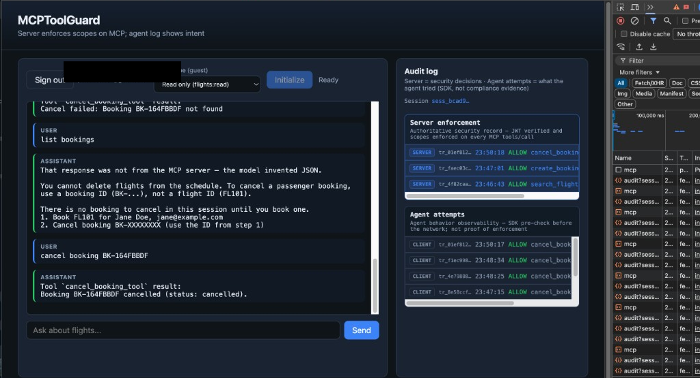
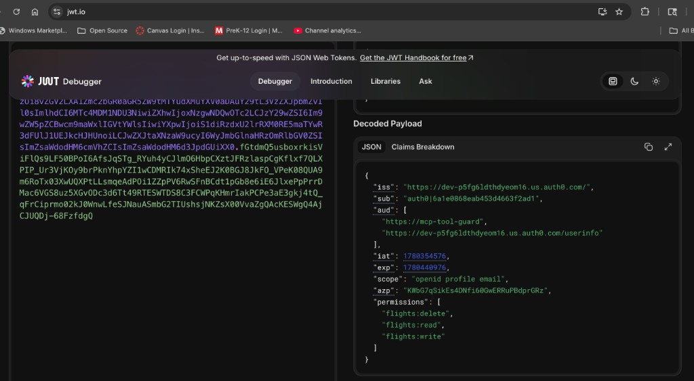
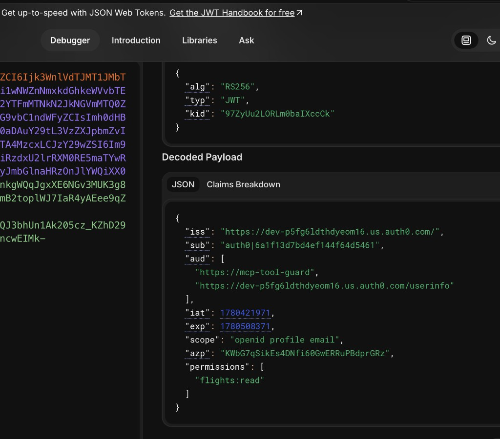
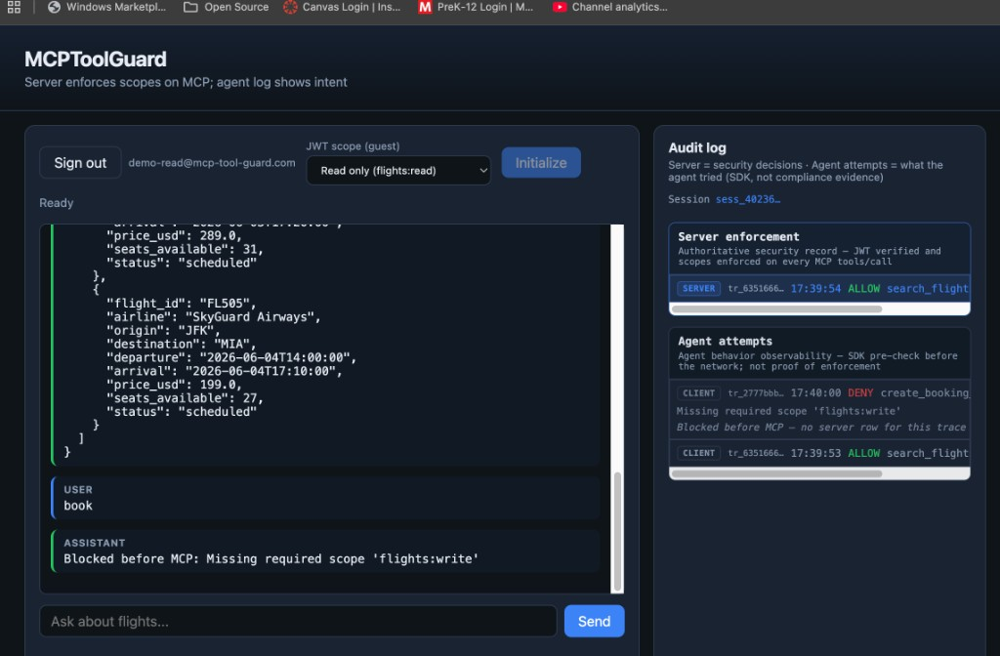
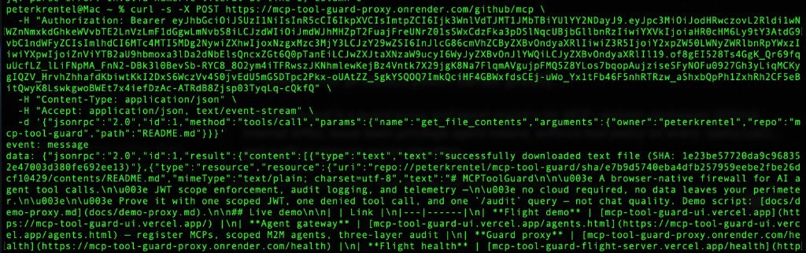
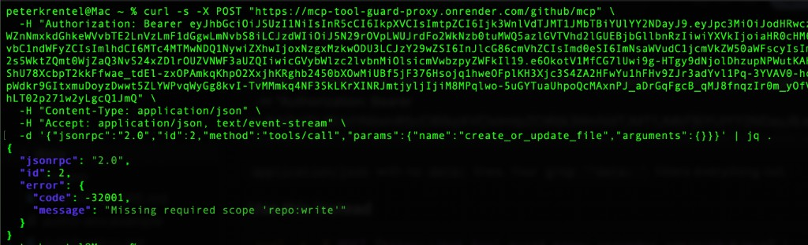

# MCPToolGuard

> A browser-native firewall for AI agent tool calls.
> JWT scope enforcement, audit logging, and telemetry —
> no cloud required, no data leaves your perimeter.
>
> Prove it with one scoped JWT, one denied tool call, and one `/audit` query — not chat quality. Demo script: [docs/demo-proxy.md](docs/demo-proxy.md).

## Live demo

| | Link |
|---|------|
| **Agent gateway** | [mcp-tool-guard-ui.vercel.app/agents.html](https://mcp-tool-guard-ui.vercel.app/agents.html) — register MCPs, scoped M2M agents, GitHub upstream proof |
| **Guard proxy** | [mcp-tool-guard-proxy.onrender.com/health](https://mcp-tool-guard-proxy.onrender.com/health) — `flight` + **`github`** live |
| **Flight demo** | [mcp-tool-guard-ui.vercel.app](https://mcp-tool-guard-ui.vercel.app/) — WebLLM chat (demo UX; enforcement story is proxy + curl) |
| **Flight health** | [mcp-tool-guard-flight-server.vercel.app/health](https://mcp-tool-guard-flight-server.vercel.app/health) |

Prod paths: **curl / agents** → Render guard proxy → **GitHub MCP** or Vercel flight (`POST /{serverId}/mcp`). Flight chat UI uses `/mcp` only. Demo script: [docs/demo-proxy.md](docs/demo-proxy.md) · GitHub proof: [docs/track2-github-proof.md](docs/track2-github-proof.md).



*Signed-in Auth0 user, tool call in chat, **Server enforcement** audit rows, `/mcp` + `/audit` in Network tab.*



*Admin user: `aud` includes `https://mcp-tool-guard`; full **`permissions`** (`flights:read`, `flights:write`, `flights:delete`).*



*Read-only user (`demo-read@…`): same `aud`; **`permissions`** is only `["flights:read"]` — book/cancel deny in the UI.*



*Search → **Server** ALLOW; `book` → **Agent attempts** DENY (`flights:write`), blocked before MCP — no matching server row.*

**Track 2 — GitHub MCP (external upstream, prod proof):** [docs/track2-github-proof.md](docs/track2-github-proof.md) · [demo-proxy Demo 6](docs/demo-proxy.md#demo-6--github-mcp-external-upstream)



*M2M agent JWT (`repo:read`) → Render proxy → GitHub Copilot MCP (`GITHUB_MCP_TOKEN`) → README.md in SSE `result`.*



*Read-only agent (`repo:read` only) → proxy `-32001` **before** GitHub — airtight scope enforce on vendor MCP.*

Pick a **JWT scope** (guest) or **Sign in** (Auth0 when configured) → **Initialize** → chat. First WebLLM load may take ~1 minute. Deploy: **[docs/deploy-overview.md](docs/deploy-overview.md)** (what runs where) · **[docs/vercel-deploy.md](docs/vercel-deploy.md)** (Vercel steps).

**Demo JWTs:** `ui/public/demo-tokens.json` and `demo-public.pem` are **intentionally public** — pre-signed guest tokens for the flight demo only, not production secrets. Production uses Auth0 JWKS or your own PEM via env vars.

## Documentation map

| Doc | Read this for |
|-----|----------------|
| **README** (here) | Quick start, live demo links |
| [docs/deploy-overview.md](docs/deploy-overview.md) | **Deploy map** — local proxy vs Vercel prod vs target; start here if confused |
| [docs/vercel-deploy.md](docs/vercel-deploy.md) | **Vercel** — flight + UI step-by-step, env vars, troubleshooting |
| [docs/guard-proxy.md](docs/guard-proxy.md) | **Guard proxy** — routes, env, `make dev`, prod checklist link |
| [docs/render-deploy.md](docs/render-deploy.md) | **Render** — deploy guard proxy to prod, smoke tests, UI rewire |
| [docs/demo-proxy.md](docs/demo-proxy.md) | **Live demo script** — Network tab, read-only deny, Render logs, curl proxy deny, GitHub MCP |
| [docs/track2-github-proof.md](docs/track2-github-proof.md) | **Track 2 prod proof** — GitHub MCP curl allow + **proxy write deny**, Render logs, screenshots |
| [docs/ARCHITECTURE.md](docs/ARCHITECTURE.md) | **Architecture** — diagrams, components, three audit planes, policy, today vs proxy |
| [docs/CONCEPT.md](docs/CONCEPT.md) | **Design** — rationale, trust model, [unowned MCP](docs/CONCEPT.md#third-party--unowned-mcp), [identity](docs/identity.md) |
| [docs/identity.md](docs/identity.md) | **IdP** — Auth0 vs Keycloak, audit auth paths, env vars |
| [auth0-setup.md](docs/auth0-setup.md) | **Auth0** — full walkthrough + troubleshooting ([screenshots](docs/images/auth0/README.md)) |
| [backlog.md](backlog.md) | **Canonical open backlog** — active and deferred work tracked in one place |
| [docs/ROADMAP.md](docs/ROADMAP.md) | **Plan** — [0.4 multi-track completion](docs/ROADMAP.md) |
| [docs/NEXT-STEPS.md](docs/NEXT-STEPS.md) | **What to build next** — Phase A–D |
| [CHANGELOG.md](CHANGELOG.md) | What shipped in [0.4.0](CHANGELOG.md#040---2026-06-22) and [Unreleased](CHANGELOG.md#unreleased) |
| [docs/RELEASE.md](docs/RELEASE.md) · [CONTRIBUTING.md](CONTRIBUTING.md) | Releases and PR workflow |

## Quick start

**First time only:**

```bash
make setup
```

Installs Python deps (`uv sync`), Node deps (`npm install`), and generates demo JWT keys (private key stays in `keys/`, gitignored).

**Every time — one command:**

```bash
make dev    # flight :8000 → proxy :8787 → ui :5173
```

Open http://localhost:5173, pick a **guest JWT scope** or configure Auth0, click **Initialize**, then chat.

- **Auth0 on flight + proxy + agent gateway:** `cp scripts/dev.env.example scripts/dev.env` and set `MCP_JWT_*` + `AUTH0_MGMT_*` (servers don't read `ui/.env.local`).
- **Auth0 in UI:** `ui/.env.local` with `VITE_AUTH0_*` — see [auth0-env.example](docs/auth0-env.example).
- **Agent gateway:** open [http://localhost:5173/agents.html](http://localhost:5173/agents.html) after `make dev`. Prod: `VITE_PROXY_BASE_URL` on Vercel — [render-deploy.md § Agent gateway](docs/render-deploy.md#agent-gateway-env-render--vercel).
- **Stuck processes:** `make stop`

<details>
<summary>Three terminals (debug one layer)</summary>

```bash
make flight    # upstream :8000
make proxy     # guard proxy :8787
make ui        # :5173
```

</details>

**Try it:** *"Search flights from SFO to JFK"* with read-only, then *"Cancel booking BK-…"* with the same token — scope denial shows in the audit panel. Token details: [CONCEPT → JWT](docs/CONCEPT.md#jwt--demo-tokens).

## Stack

| Layer | Location |
|-------|----------|
| Flight MCP server (Python, FastMCP) | `servers/flight/` |
| `ToolGuard` SDK (TypeScript) | `gateway/` |
| Demo UI (Vite, WebLLM) | `ui/` |

Architecture diagrams: **[docs/ARCHITECTURE.md](docs/ARCHITECTURE.md)**. Design and audit trust model: **[docs/CONCEPT.md](docs/CONCEPT.md)**.

## Repo structure

```
mcp-tool-guard/
├── Makefile
├── gateway/          ← ToolGuard SDK (JWT + scopes + audit logger)
├── ui/               ← WebLLM agent + audit panel
├── servers/flight/   ← MCP server + server-side guard
├── docs/             ← CONCEPT, ROADMAP, cursor-guide, vercel-deploy, RELEASE
└── scripts/generate-keys.mjs
```

## Deploy

**Overview:** [docs/deploy-overview.md](docs/deploy-overview.md) — three services (UI on Vercel, proxy on Render, flight on Vercel).

**Vercel walkthrough:** [docs/vercel-deploy.md](docs/vercel-deploy.md)

| Project | Key settings |
|---------|----------------|
| **Flight** (`servers/flight`) | Root `servers/flight`; `MCP_GUARD_PUBLIC_KEY_PEM` + `MCP_JWT_*` for Auth0 |
| **UI** (repo root) | `npm ci` + build gateway + ui; `VITE_MCP_URL`, `VITE_AUTH0_*` |
| **Guard proxy** (Render, not Vercel) | `npm run start:proxy -w @mcp-tool-guard/gateway` — [render-deploy.md](docs/render-deploy.md) · [guard-proxy.md](docs/guard-proxy.md) |

Guest demo JWTs ship in `ui/public/demo-tokens.json` — no token env vars required for guest mode. Auth0: [auth0-setup.md](docs/auth0-setup.md).

Regenerate Python deps after `pyproject.toml` changes:

```bash
uv export --directory servers/flight --no-hashes -o servers/flight/requirements.txt
```

## Contributing

Feature branch + PR; update [CHANGELOG.md](CHANGELOG.md) under `[Unreleased]`. See [CONTRIBUTING.md](CONTRIBUTING.md).

**Implementation order (Cursor / agents):** [docs/cursor-guide.md](docs/cursor-guide.md) — Tracks 1–3 **complete** in [0.4.0](CHANGELOG.md#040---2026-06-22) ([track2-github-proof](docs/track2-github-proof.md), [track3-approval-queue-proof](docs/track3-approval-queue-proof.md)). Active priorities now live in [backlog.md](backlog.md).

## License

MIT
