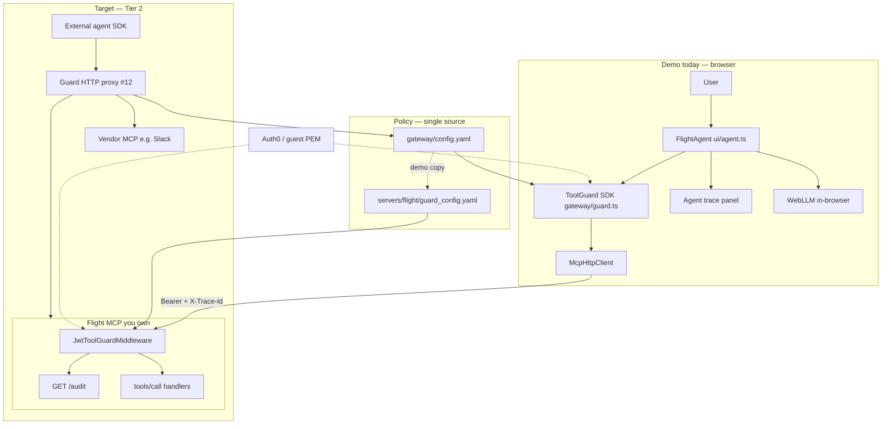
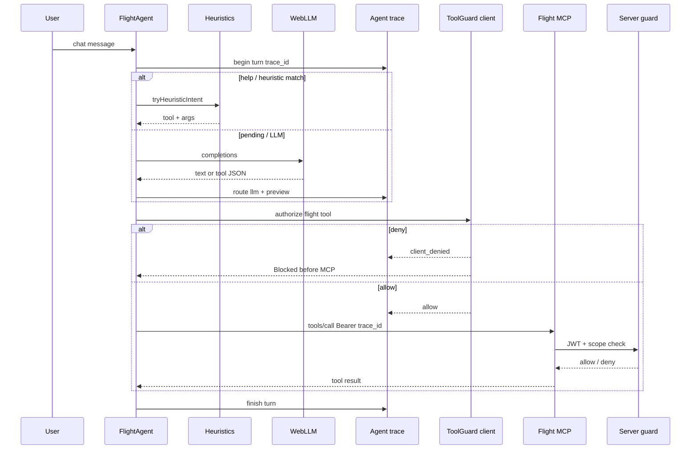
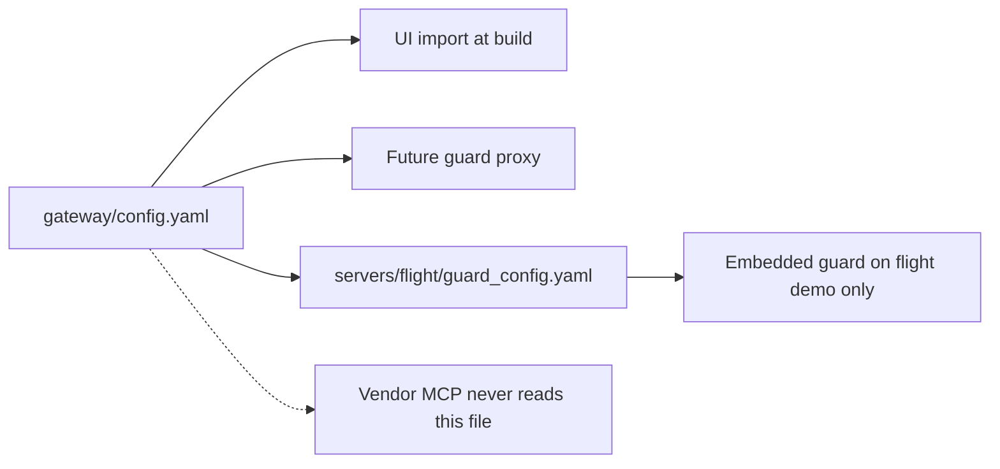
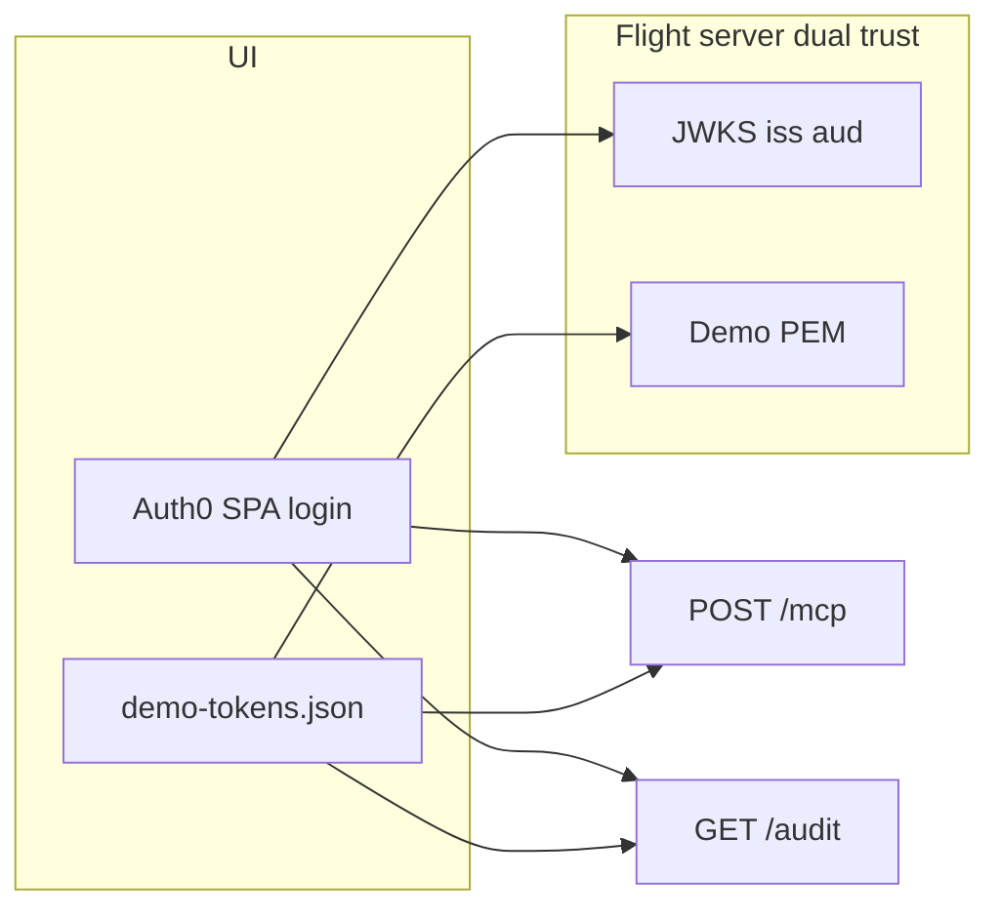

# Architecture

**Navigation:** [CONCEPT](CONCEPT.md) (design rationale) · [Identity](identity.md) · [Quick start](../README.md) · [Vercel deploy](vercel-deploy.md) · [kv-design](kv-design.md) · [Roadmap](ROADMAP.md)

One-page view of how the demo fits together today and where it is headed (guard proxy, multi-server). Task checklists stay in [ROADMAP.md](ROADMAP.md).

---

## System context

| Layer | Authoritative for security? |
|-------|---------------------------|
| **Server enforcement** (flight middleware or future proxy) | **Yes** — JWT + scopes on every `tools/call` |
| **Agent attempts** (client `ToolGuard`) | No — pre-check + intent log |
| **Agent trace** (demo UI) | No — routing / model observability |

---

## One user message (demo browser)

**Correlation:** one `trace_id` per user message ties **Agent trace**, **Agent attempts**, and **Server enforcement** (when MCP was called). Client deny → agent + client rows only; no server row.

---

## Three observability planes (demo UI)

| Plane | Source | Question it answers | Trust |
|-------|--------|---------------------|-------|
| **Agent trace** | `ui/src/agent-trace.ts` | Heuristic vs LLM? What did the model return? Outcome before/after guard? | Debug only |
| **Agent attempts** | `ToolGuard` logger in browser | Which tool, scopes, allow/deny on **client** pre-check? | Debug only |
| **Server enforcement** | `GET /audit` on flight server | What **reached** MCP? JWT valid? Final allow/deny? | **Authoritative** |

Click a **trace id** in the audit panel to highlight rows across all three sections.

---

## Policy and configuration

| File | Role |
|------|------|
| [`gateway/config.yaml`](../gateway/config.yaml) | **Canonical** — per-server `url` + per-tool `required_scope` (flight, slack/github stubs) |
| [`ui/src/guard-config.ts`](../ui/src/guard-config.ts) | Loads canonical yaml; `TOOL_DESCRIPTIONS` for LLM hints only |
| [`servers/flight/guard_config.yaml`](../servers/flight/guard_config.yaml) | **Demo only** — embedded guard until [#12 proxy](CONCEPT.md#third-party--unowned-mcp); CI `npm run check:demo-policy` keeps flight slice aligned |

---

## Identity and tokens

Details: [identity.md](identity.md), [auth0-setup.md](auth0-setup.md).

---

## Deployment (demo)

| Service | Repo path | Notes |
|---------|-----------|--------|
| **UI** | `ui/` → Vercel | Proxies `/mcp`, `/audit` to flight in dev; prod uses `VITE_MCP_URL` |
| **Flight MCP** | `servers/flight/` → Vercel | KV optional for audit + bookings ([kv-design.md](kv-design.md)) |

---

## Component map

| Component | Path | Responsibility |
|-----------|------|----------------|
| Agent loop | `ui/src/agent.ts` | WebLLM + heuristics + tool execution |
| Agent trace | `ui/src/agent-trace.ts` | Per-turn routing log |
| Audit UI | `ui/src/audit-view.ts` | Server + client + trace panels |
| Client guard | `gateway/guard.ts` | JWT verify + scope check |
| MCP client | `ui/src/mcp-client.ts` | JSON-RPC `tools/call`, trace headers |
| Server guard | `servers/flight/guard.py` | Authoritative enforce + audit store |
| Middleware | `servers/flight/guard_middleware.py` | Intercept `tools/call` |

---

## Today vs next

| | Today (0.3.x demo) | Next (roadmap) |
|--|-------------------|----------------|
| Enforcement on flight | Embedded in flight process | Optional; proxy becomes primary for vendors |
| Agent | Browser WebLLM only | SDK agents + proxy ([#12](ROADMAP.md)) |
| Multi-server | Flight + documents MCP (owned) | UI routes `authorize(server, …)` per tool ([#9](ROADMAP.md) / [#10](ROADMAP.md)) |
| Unowned / vendor MCP | Client pre-check only | **Capstone:** guard proxy [#12](ROADMAP.md) |
| Observability export | Browser panels + `/audit` | Grafana/Loki sink (Tier 2) |

**Build order:** #9+#10 → #12. See [NEXT-STEPS](NEXT-STEPS.md#implementation-backlog-post-030).

Design tradeoffs and limitations: [CONCEPT.md](CONCEPT.md).
