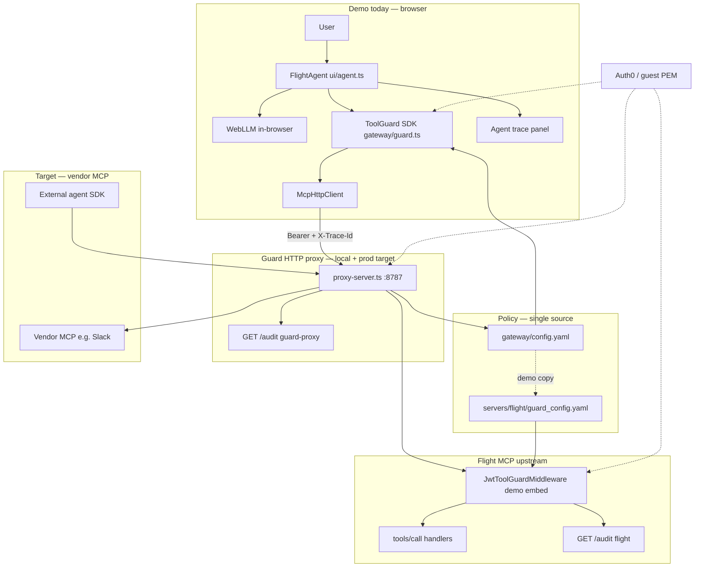
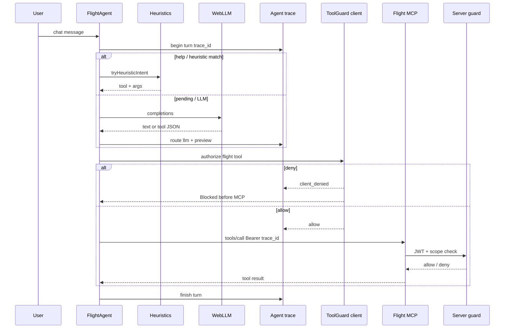
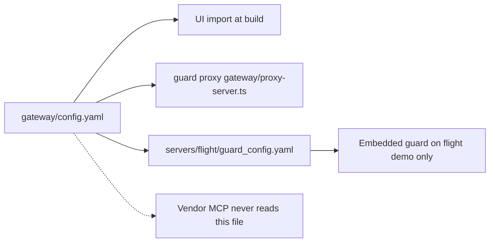
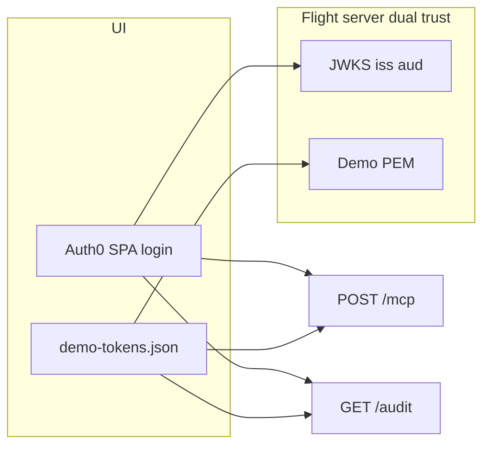

# Architecture

**Navigation:** [Deploy overview](deploy-overview.md) · [CONCEPT](CONCEPT.md) (design rationale) · [Identity](identity.md) · [Quick start](../README.md) · [Vercel deploy](vercel-deploy.md) · [Guard proxy](guard-proxy.md) · [kv-design](kv-design.md) · [Roadmap](ROADMAP.md)

One-page view of how the demo fits together: local proxy path, Vercel prod today, and vendor MCP target. Deploy paths: [deploy-overview.md](deploy-overview.md). Task checklists: [ROADMAP.md](ROADMAP.md).

---

## System context

| Layer | Authoritative for security? |
| ----- | -------------------------- |
| **Proxy / server enforcement** (guard proxy or flight middleware) | **Yes** — JWT + scopes on every `tools/call` |
| **Agent attempts** (client `ToolGuard`) | No — pre-check + intent log |
| **Agent trace** (demo UI) | No — routing / model observability |

---

## One user message (demo browser)

**Correlation:** one `trace_id` per user message ties **Agent trace**, **Agent attempts**, and **Server enforcement** (when MCP was called). Client deny → agent + client rows only; no server row.

---

## Three observability planes (demo UI)

| Plane | Source | Question it answers | Trust |
| ----- | ------ | ------------------- | ----- |
| **Agent trace** | `ui/src/agent-trace.ts` | Heuristic vs LLM? What did the model return? Outcome before/after guard? | Debug only |
| **Agent attempts** | `ToolGuard` logger in browser | Which tool, scopes, allow/deny on **client** pre-check? | Debug only |
| **Proxy / server enforcement** | `GET /audit` on proxy (`guard-proxy`) or flight (Vercel today) | What **reached** MCP? JWT valid? Final allow/deny? | **Authoritative** |

Click a **trace id** in the audit panel to highlight rows across all three sections.

---

## Policy and configuration

| File | Role |
| ---- | ---- |
| [`gateway/config.yaml`](../gateway/config.yaml) | **Canonical** — per-server `url` + per-tool `required_scope` (flight, github live; slack stub) |
| [`ui/src/guard-config.ts`](../ui/src/guard-config.ts) | Loads canonical yaml; `TOOL_DESCRIPTIONS` for LLM hints only |
| [`servers/flight/guard_config.yaml`](../servers/flight/guard_config.yaml) | **Demo only** — embedded guard on flight; CI `npm run check:demo-policy` keeps flight slice aligned |
| [`gateway/proxy-server.ts`](../gateway/proxy-server.ts) | **Product path** — enforce + forward + proxy `/audit`; local `make dev`, prod on [Render](render-deploy.md) |

---

## Identity and tokens

Details: [identity.md](identity.md), [auth0-setup.md](auth0-setup.md).

---

## Deployment

Full map: [deploy-overview.md](deploy-overview.md). Vercel steps: [vercel-deploy.md](vercel-deploy.md).

| Service | Repo path | Local | Prod |
| ------- | --------- | ----- | ---- |
| **UI** | `ui/` | Vite :5173 | Vercel — `mcp-tool-guard-ui`; `VITE_MCP_URL` → Render proxy |
| **Guard proxy** | `gateway/proxy-server.ts` | `:8787` via `make dev` | Render — `mcp-tool-guard-proxy.onrender.com` |
| **Flight MCP** | `servers/flight/` | `:8000` | Vercel — `mcp-tool-guard-flight-server`; upstream behind proxy |

Local Vite proxies `/mcp` and `/audit` to the guard proxy ([`ui/vite.config.ts`](../ui/vite.config.ts)). Prod UI talks to Render proxy (`VITE_MCP_URL`).

---

## Component map

| Component | Path | Responsibility |
| --------- | ---- | -------------- |
| Agent loop | `ui/src/agent.ts` | WebLLM + heuristics + tool execution |
| Agent trace | `ui/src/agent-trace.ts` | Per-turn routing log |
| Audit UI | `ui/src/audit-view.ts` | Server + client + trace panels |
| Client guard | `gateway/guard.ts` | JWT verify + scope check |
| MCP client | `ui/src/mcp-client.ts` | JSON-RPC `tools/call`, trace headers |
| Guard proxy | `gateway/proxy-server.ts` | Authoritative enforce + forward + proxy audit |
| Server guard | `servers/flight/guard.py` | Demo embedded enforce + audit store on flight |
| Middleware | `servers/flight/guard_middleware.py` | Intercept `tools/call` on flight |

---

## Today vs next

| Surface | Local `make dev` | Prod (Render + Vercel) | Next |
| ------- | ---------------- | ---------------------- | ---- |
| MCP path | UI → proxy → flight or `/{id}/mcp` | UI/curl → Render proxy → flight or **GitHub MCP** | More vendor MCPs; backend agent examples |
| Authoritative enforce | Guard proxy :8787 | Render guard proxy | Same |
| `/audit` source | `guard-proxy` | `guard-proxy` on Render | Audit export / OTel sink |
| Agent | Browser WebLLM / gateway agent | Same + M2M agents + approval queue | SDK agents + packaged gateway integrations |
| Multi-server | `/agents.html` per-server routing; `/` = flight only | Same | **Deferred:** [#9](ROADMAP.md) / [#10](ROADMAP.md) |
| Vendor MCP | github wired locally + prod | **GitHub live** — [proof](track2-github-proof.md) | Additional vendor MCPs as needed |
| Observability export | Browser panels + `/audit` | Same | Grafana/Loki sink (Tier 2) |

**Build order:** post-Track-3 hardening — registry/Auth0 sync, audit export, SDK packaging, and broader backend agent adoption. See [NEXT-STEPS](NEXT-STEPS.md#implementation-backlog-post-030), [track2-github-proof.md](track2-github-proof.md), [track3-approval-queue-proof.md](track3-approval-queue-proof.md).

Design tradeoffs and limitations: [CONCEPT.md](CONCEPT.md).
