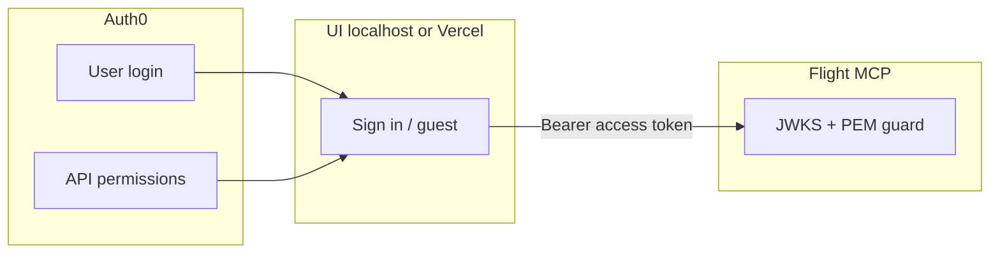

# Auth0 setup (0.3)

**Navigation:** [Identity overview](identity.md) · [Env template](auth0-env.example) · [Next steps](NEXT-STEPS.md) · [Screenshots folder](images/auth0/README.md)

End-to-end Auth0 configuration for the demo UI and flight MCP server: dashboard checklist, **local dev**, Vercel env, token verification, and troubleshooting.

**Example tenant** (replace with yours): `dev-p5fg6ldthdyeom16.us.auth0.com`

---

## Overview



| Component | Auth0 role |
|-----------|------------|
| **SPA** (`mcp-tool-guard`) | User logs in; gets access token |
| **API** (`https://mcp-tool-guard`) | Defines `flights:*` permissions + audience |
| **Flight server** | Validates token (JWKS + scopes); **not** an Auth0 app |

---

## Part 1 — Auth0 dashboard

### Step 1 — Note your tenant domain

1. Log in at [auth0.com](https://auth0.com)
2. Top-left tenant menu → note **Tenant Name** + **Region**

Full domain is usually:

```text
<TENANT_NAME>.us.auth0.com
```

Example: `dev-p5fg6ldthdyeom16.us.auth0.com`

Confirm under **Settings → Tenant Settings → General** (Tenant Name + Region).


---

### Step 2 — Create the API (audience + permissions)

**Applications → APIs → Create API**

| Field | Value |
|-------|--------|
| Name | `api-for-mcp-tool-guard` (friendly name; any label OK) |
| **Identifier** | `https://mcp-tool-guard` ← this is **`aud`** everywhere |
| Signing algorithm | RS256 |

**API → Permissions tab** — add:

| Permission | Demo profile |
|------------|--------------|
| `flights:read` | read_only |
| `flights:write` | booking |
| `flights:delete` | admin cancel |


---

### Step 3 — Enable RBAC on the API

**API → Settings** → scroll to **RBAC Settings**

Turn **both** toggles **ON**, then **Save**:

| Toggle | Required |
|--------|----------|
| **Enable RBAC** | ON |
| **Add Permissions in the Access Token** | ON |

Without the second toggle, access tokens only get `scope: openid profile email` — **no** `flights:*`.


**Application Access Policy** (same Settings page):

| Setting | Value |
|---------|--------|
| User-delegated Access | **Per-app authorization** |
| Client Access | Per-app authorization (or Unauthorized — M2M not used) |

---

### Step 4 — Authorize the SPA on the API

**API → Application Access** tab

Find **`mcp-tool-guard`** (Single Page Application). Set:

| Column | Target |
|--------|--------|
| **User-delegated Access** | **Authorized** — **3 / 3 permissions granted** |
| Client Access | Unauthorized (0/3) is fine |


**Alternate path (same result):** **Applications → Applications → `mcp-tool-guard` → API Access** → authorize `api-for-mcp-tool-guard` with 3/3 user-delegated permissions.


---

### Step 5 — Create / configure the SPA

**Applications → Applications → Create Application**

| Field | Value |
|-------|--------|
| Name | `mcp-tool-guard` |
| Type | **Single Page Application** |

**Settings:**

| Setting | Values |
|---------|--------|
| Allowed Callback URLs | `http://localhost:5173`, `https://mcp-tool-guard-ui.vercel.app` |
| Allowed Logout URLs | same |
| Allowed Web Origins | same |

Copy **Client ID** → `VITE_AUTH0_CLIENT_ID`.


---

### Step 6 — Create a test user and assign permissions

**User Management → Users → Create User** (email + password).

Open the user → **Permissions** tab → **Assign Permissions**:

- API: `https://mcp-tool-guard` (shown as `api-for-mcp-tool-guard`)
- Permissions: e.g. all three `flights:*` for admin testing

| Persona | Permissions |
|---------|-------------|
| Read-only | `flights:read` |
| Booking | `flights:read`, `flights:write` |
| Admin | `flights:read`, `flights:write`, `flights:delete` |


**Authorized Applications** tab showing the SPA is **not** the same as Permissions — both should exist, but only Permissions puts `flights:*` in the token.

---

## Part 2 — Local development

### Step 7 — UI env file

Copy [auth0-env.example](auth0-env.example) → **`ui/.env.local`** (gitignored):

```bash
VITE_AUTH0_DOMAIN=dev-p5fg6ldthdyeom16.us.auth0.com
VITE_AUTH0_CLIENT_ID=<SPA Client ID>
VITE_AUTH0_AUDIENCE=https://mcp-tool-guard
VITE_MCP_URL=http://localhost:5173/mcp
```

Restart **`make ui`** after any change (Vite reads env at startup).

### Step 8 — Flight server env (Auth0 path)

Guest demo works without these. For **Sign in** tokens, export before **`make flight`**:

```bash
export MCP_JWT_ISSUER=https://dev-p5fg6ldthdyeom16.us.auth0.com/
export MCP_JWT_AUDIENCE=https://mcp-tool-guard
make flight
```


Terminal 2: `make ui` → open `http://localhost:5173`

### Step 9 — Sign in and smoke test

1. Click **Sign in** → Auth0 login → return to localhost
2. **Initialize** (WebLLM may take ~1 min first load)
3. *Search flights from SFO to JFK* → should **allow** if user has `flights:read`
4. *Cancel booking …* with read-only user → **deny** in audit

Guest mode still works: use JWT dropdown without signing in.


---

## Part 3 — Verify the access token

Use the **access token**, not the ID token.

### Where to find it in the browser

**DevTools → Application → Local Storage → `http://localhost:5173`**

Use the row whose key contains **`https://mcp-tool-guard`**. Copy `body.access_token` (the long `eyJ…` string).

Do **not** use the `@@user@@` row — that is the **ID token** (`aud` = Client ID, has `email` / `picture`).


Decode at [jwt.io](https://jwt.io). **Good access token payload:**

```json
{
  "iss": "https://dev-p5fg6ldthdyeom16.us.auth0.com/",
  "aud": ["https://mcp-tool-guard", "https://…/userinfo"],
  "scope": "openid profile email",
  "permissions": ["flights:delete", "flights:read", "flights:write"]
}
```

| Claim | Meaning |
|-------|---------|
| `aud` includes `https://mcp-tool-guard` | Correct API token |
| `permissions` | Auth0 RBAC — **enforced by MCPToolGuard** |
| `scope` | Often only OIDC scopes; `flights:*` live in `permissions` |

After changing RBAC or user permissions: **Sign out → Sign in** (old tokens do not update).

---

## Part 4 — Vercel environment variables

Deploy **flight first**, then **UI**. See [vercel-deploy.md](vercel-deploy.md).

### Flight (`mcp-tool-guard-flight-server`)

| Variable | Example |
|----------|---------|
| `MCP_GUARD_PUBLIC_KEY_PEM` | Keep — guest demo PEM |
| `MCP_JWT_ISSUER` | `https://dev-p5fg6ldthdyeom16.us.auth0.com/` |
| `MCP_JWT_AUDIENCE` | `https://mcp-tool-guard` |
| `MCP_JWT_JWKS_URL` | Optional — derived from issuer |

### UI (`mcp-tool-guard-ui`)

| Variable | Example |
|----------|---------|
| `VITE_MCP_URL` | `https://mcp-tool-guard-flight-server.vercel.app/mcp` |
| `VITE_AUTH0_DOMAIN` | `dev-p5fg6ldthdyeom16.us.auth0.com` |
| `VITE_AUTH0_CLIENT_ID` | SPA Client ID |
| `VITE_AUTH0_AUDIENCE` | `https://mcp-tool-guard` |

Redeploy **both** after env changes (UI needs a **rebuild**).

---

## Troubleshooting

| Symptom | Cause | Fix |
|---------|--------|-----|
| Sign in redirect error | Callback URL mismatch | Add exact `http://localhost:5173` to SPA Settings |
| Token `aud` = Client ID, has `email` | Decoded **ID token** | Use access token from localStorage key with `https://mcp-tool-guard` |
| No `permissions` in token | RBAC off or not saved | Step 3 toggles ON + Save; Sign out/in |
| `permissions` present but still deny | Guard read only `scope` (pre-fix) | Merge PR with `permissions` claim support |
| Deny with empty scopes | User lacks API permissions | Step 6 — user Permissions tab |
| SPA 3/3 but token empty | Add Permissions in Access Token off | Step 3 |
| Server audit 401 locally | No Bearer on `/audit` | Initialize first; same token as MCP |
| Auth0 allow, server deny | Flight missing `MCP_JWT_*` | Step 8 exports before `make flight` |
| Guest works, Auth0 fails on server | Dual trust | Keep PEM **and** set `MCP_JWT_*` on flight |

---

## Smoke test checklist

- [ ] Guest: dropdown → Initialize → search allow, cancel deny
- [ ] Auth0: Sign in → Initialize → search allow (with `flights:read`)
- [ ] Access token has `permissions` array after RBAC enabled
- [ ] Server enforcement panel shows rows after tool calls
- [ ] `curl /audit` without Bearer → 401 (when guard enabled)

---

## Keycloak later

Same env semantics — swap issuer/JWKS URLs only:

| Auth0 | Keycloak |
|-------|----------|
| `MCP_JWT_ISSUER` | `https://<host>/realms/<realm>` |
| `MCP_JWT_JWKS_URL` | From OpenID discovery `jwks_uri` |
| `MCP_JWT_AUDIENCE` | Client / resource audience |

---

## Related

- [identity.md](identity.md) — dual trust (guest PEM + Auth0 JWKS)
- [auth0-env.example](auth0-env.example) — copy-paste env template
- [images/auth0/README.md](images/auth0/README.md) — screenshot filenames for this doc
