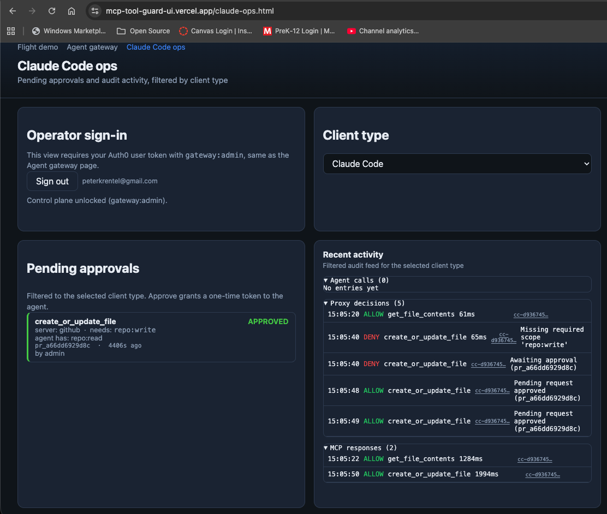
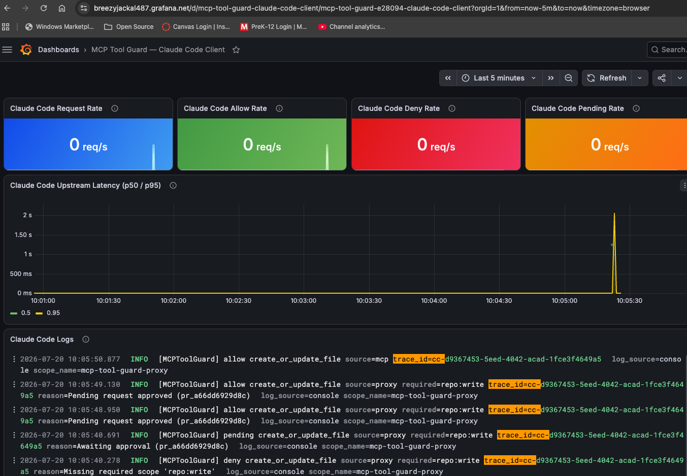
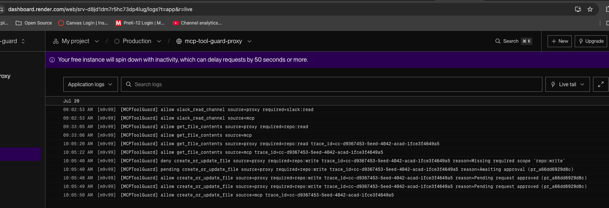

# Claude Code demo — prod guard proxy (BL-037 follow-up)

**Navigation:** [Claude Code integration (local dev)](claude-code-integration.md) · [Track 2 GitHub proof](track2-github-proof.md) · [Guard proxy](guard-proxy.md) · [Architecture](ARCHITECTURE.md)

Where `claude-code-integration.md` documents Claude Code as an MCP client against the **local** dev proxy, this doc is the **prod** complement: driving the real, deployed Render guard proxy (`https://mcp-tool-guard-proxy.onrender.com`) from Claude Code, ending in a human-approved GitHub write.

This version assumes no prior context — it's written to explain, from scratch, both *what MCPToolGuard just proved* and *exactly how Claude Code's side of it works mechanically*, with screenshots, for anyone (technical or not) who needs the story.

## TL;DR

MCPToolGuard sits between an AI agent and a real tool server, and enforces "this credential can only do X" — even if the agent tries something else, and even if the agent has no idea a guard exists.

In this run:

- Claude Code, holding a credential that can only **read** from GitHub, tried to **write** a file.
- The guard blocked it instantly — wrong permission.
- Instead of just failing, the request was held open, waiting for a human to review it.
- A human (you) approved it live from a dashboard.
- Only *then* did the write happen — a real commit landed on GitHub.
- Every step of that — the block, the hold, the approval, the eventual write — is a separate row in an audit log, all tagged with one shared ID so they can be correlated.

This is the core "guard hypothesis" working end-to-end against a **real, unmodified external system** (GitHub's own MCP server) via a **real, independent AI client** (Claude Code, a product this project doesn't control) — not a toy example where both ends are code we wrote ourselves.

## Glossary

Skip this section if these terms are already familiar.

- **MCP (Model Context Protocol)** — the protocol an AI agent uses to discover and call "tools" (e.g. "create a file," "search flights") exposed by a server.
- **JWT** — a signed token that says who/what is making a request and what it's allowed to do (its "scopes").
- **Scope** — one specific permission, e.g. `repo:read` or `repo:write`.
- **Agent** (this project's term) — a registered machine identity (M2M — machine-to-machine, not a human user) with a JWT and a fixed set of scopes.
- **Guard proxy** — the component sitting between the agent and the real tool server, checking the JWT's scopes against policy before forwarding anything, and logging every decision.
- **Pending approval** — instead of a hard deny, the guard can hold a sensitive request open and wait for a human to approve or deny it, rather than failing it outright.

## The cast, in this specific run

| Role | Who / what |
|---|---|
| The agent | Claude Code (this CLI), calling tools on your behalf |
| The agent's credential | a static JWT scoped `repo:read` only |
| The guard | the deployed guard proxy at `mcp-tool-guard-proxy.onrender.com` |
| The upstream tool server | GitHub's own real MCP server |
| The human approver | you, signed into the Claude Code ops view with an admin Auth0 login |
| The target | this repo, `peterkrentel/mcp-tool-guard`, file `demo-guard.md` |

## Setup — how `ghprod` actually got wired up

`claude-code-integration.md`'s equivalent section covers the **local** `github-guarded` connection, which is fully scriptable end-to-end because local dev runs with control-plane auth off (`MCP_GUARD_ENABLED=false` — see `docs/identity.md`). Prod is different: `gateway/proxy-routes-agents-token.ts` requires a `gateway:admin` bearer token on **every** control-plane route — `POST /agents`, `POST /token`, and `POST /agents/:clientId/token` alike — whenever control-plane auth is enabled, which it is in prod. That means creating the agent and minting its first token both genuinely need a human, logged in as admin, at least once. Here's exactly how that happened for `ghprod`:

1. **Sign in as admin.** Opened [`/agents.html`](https://mcp-tool-guard-ui.vercel.app/agents.html), signed in with Auth0 (an account with the `gateway:admin` role).
2. **Created the M2M agent via the "Create agent" form** — name `claude-code-prod`, MCP server `github` (already registered), scope `repo:read`. This calls `POST /agents`, satisfied by the admin session from step 1.
3. **Grabbed the `clientSecret` from DevTools.** The UI never displays it after creation (BL-048) — opened DevTools → Network, found the `POST /agents` response, and copied `clientId`/`clientSecret` out of the raw JSON body. This produced the Auth0 application `mcp-agent-claude-code-prod` (see `docs/auth0-setup.md`'s tenant inventory).
4. **Minted a token.** `POST /token` also needs `gateway:admin`, so the same admin's bearer token (also grabbed from DevTools/`localStorage`) went in the `Authorization` header, with the new agent's `clientId`/`clientSecret` in the body:

   ```bash
   curl -X POST https://mcp-tool-guard-proxy.onrender.com/token \
     -H "Authorization: Bearer <admin access token>" \
     -H "Content-Type: application/json" \
     -d '{"clientId":"<clientId>","clientSecret":"<clientSecret>"}'
   # -> {"token": "...", "expiresIn": ...}
   ```

5. **Stored the resulting JWT as a static token** — `MCP_PROD_STATIC_TOKEN` in `scripts/dev.env` (gitignored), alongside `MCP_PROD_SERVER_URL=https://mcp-tool-guard-proxy.onrender.com/github/mcp`.
6. **`scripts/claude-mcp-token-helper-prod-demo.sh`** (already in the repo) just sources `MCP_PROD_STATIC_TOKEN` and prints the headers Claude Code needs — no per-connection minting, since there's no scripted way to repeat step 4 without a human admin present.
7. **Registered the server with Claude Code:**

   ```bash
   claude mcp add-json ghprod '{"type":"http","url":"https://mcp-tool-guard-proxy.onrender.com/github/mcp","headersHelper":"./scripts/claude-mcp-token-helper-prod-demo.sh"}' --scope local
   ```

   Stored in `~/.claude.json` under `local` scope, same as `github-guarded` — nothing MCP-config-related is committed to this repo.

**Known limitation:** this token is static — no refresh, good only until its own `exp` claim (BL-048). Rotating it means repeating steps 1–5 by hand. This is also exactly why BL-049 exists: every step above needs a human admin in the loop, with no scripted shortcut today.

**To wire up a different MCP server the same way:** swap `github`/`repo:read` in step 2 for the new server's `serverId` and the scope it needs, and swap the URL/registered name in steps 5–7 accordingly — everything else (the admin-gate reason, the DevTools-secret step, the static-token tradeoff) applies identically regardless of which upstream MCP is behind it.

## Step by step: what happened, in order

1. Claude Code checked the target file didn't already exist (`get_file_contents`) — allowed immediately; the credential has `repo:read`.
2. Claude Code called `create_or_update_file` — this needs `repo:write`. The credential doesn't have it.
3. The guard denied it instantly on scope. But because this particular call opted into "hold for approval" mode, instead of just failing it was queued (id `pr_a66dd6929d8c`) and the underlying connection stayed open, waiting.
4. You opened the **Claude Code ops view** — a dashboard built specifically to surface pending requests and recent activity, filterable by which kind of client (Claude Code vs. the project's own browser UI) originated them — and saw the pending card:

   

   *Agent has `repo:read`, the call needs `repo:write`. You clicked **Approve**.*

5. The instant you approved, the guard automatically forwarded the original, already-queued request to GitHub's real API — Claude Code didn't need to retry or resend anything; its one tool call simply sat waiting and then returned a real result.
6. A real commit landed on GitHub: [`6f48fd6`](https://github.com/peterkrentel/mcp-tool-guard/commit/6f48fd6590f3dc46c7085ae9ed4d35f274b66a0a).
7. Every one of these steps produced its own row in the audit log (`GET /audit` on the deployed proxy), all sharing one trace id — `cc-d9367453-5eed-4042-acad-1fce3f4649a5` — so they can be reconstructed as a single story after the fact, from either Grafana or the ops view.

## How Claude Code actually talks to an MCP tool

This is worth understanding on its own, separate from the guard: it explains what's actually happening whenever you see me call a tool like `create_or_update_file`.

It is **not** a shell command and **not** a script running per call. It's a single network request, and it goes through four distinct steps:

**1. Discovery (once, at session start).** Your Claude Code config (`~/.claude.json`) lists MCP servers you've registered — in this case two: `ghprod` (the prod guard proxy) and `github-guarded` (a local dev guard proxy). Rather than eagerly loading every tool's full parameter schema from every configured server up front — there can be dozens across all your connected MCPs — Claude Code initially just lists tool *names*, prefixed by which server they came from: `mcp__ghprod__create_or_update_file` and `mcp__github-guarded__create_or_update_file` are two distinct tool names, even though they're "the same" underlying GitHub tool, because they come through two different server connections with different credentials behind them.

**2. Selection (conversational, not automatic).** Nothing in Claude Code decides "use `ghprod` for this" on its own — there's no routing logic based on task intent. In this session, *you* told me to use `ghprod` after I asked which one was "prod," and I confirmed what each name actually pointed to by reading the real config rather than guessing.

**3. Loading the schema (on demand).** Before I can call a tool with real arguments, I have to fetch its parameter definitions — a step called `ToolSearch` here (`select:mcp__ghprod__create_or_update_file,...`). Before that, I only knew the tool existed by name, not what arguments it took.

**4. Invocation — the actual network call.** When I decide to call the tool, I emit a structured request: a tool name plus JSON arguments (`owner`, `repo`, `path`, `content`, `branch`, ...). Claude Code's harness turns that into one HTTP POST carrying an MCP JSON-RPC message:

```
POST https://mcp-tool-guard-proxy.onrender.com/github/mcp
Authorization: Bearer <jwt>
X-Trace-Id: cc-d9367453-...
X-Wait-For-Approval: true
Content-Type: application/json

{"jsonrpc":"2.0","id":1,"method":"tools/call",
 "params":{"name":"create_or_update_file","arguments":{"owner":"peterkrentel", ...}}}
```

The `Authorization` and `X-Trace-Id` headers come from `headersHelper` (`scripts/claude-mcp-token-helper-prod-demo.sh`) — a small script Claude Code runs **once per connection**, not once per call. It just prints a JSON object of headers to stdout, which gets reused for every subsequent call until the connection is re-established. It never sees the tool name or arguments — those are added by the harness at call time. It's a workaround for BL-048 (`/agents.html`'s "Create agent" flow never surfaces a `clientSecret`, so there's no way to mint fresh, short-lived tokens on demand the way the local dev version of this helper does) — the static token it sources has no refresh and is only good until its own `exp` claim expires.

**5. One response, back to me.** Whatever happened server-side — allow, deny, or (as below) a scope-deny held open and eventually resolved — I see it as exactly one tool result.

## The deny → pending → approve → allow lifecycle (code-level)

This is what happened *inside* that one held-open HTTP request, step 3 above, server-side:

1. **Scope check, first audit line.** `handleMcpRoute` (`gateway/proxy-routes-mcp.ts`) calls `guard.authorize()` → `checkScope()` (`gateway/guard.ts`). Missing scope logs `decision: "deny"` immediately, before any approval logic runs.
2. **Pending creation.** `createPendingRequest()` (`gateway/pending-store.ts`) mints a `pr_<12 hex>` id and logs `decision: "pending"`.
3. **Long-poll hold.** Because the request carried `X-Wait-For-Approval: true`, the same HTTP connection stays open server-side via `waitForPendingResolution()` (`gateway/pending-store.ts`), which re-checks the pending record every 750ms until approved/denied or `pendingLongPollMaxMs()` (default 120s, `gateway/env.ts`) elapses. This is the BL-045 fix — see `docs/claude-code-integration.md` for what it looked like *before* this existed, when an approved write could be silently lost because nothing replayed it.
4. **Human approval.** `POST /pending/:id/approve` (`gateway/proxy-routes-pending.ts`), triggered by the Approve button in `ui/claude-ops.html`, resolves the pending record and logs its own `allow`.
5. **Forward and final result.** Once resolved, the held request forwards to the real GitHub MCP upstream and logs a `source: "mcp"` `allow` — this is the response Claude Code's `tools/call` finally receives.

## Full audit trail (raw)

Observed via the Claude Code ops view and Grafana, all sharing trace id `cc-d9367453-5eed-4042-acad-1fce3f4649a5`:

| Time (UTC) | Source | Decision | Tool | Detail |
|---|---|---|---|---|
| 15:05:20.875 | proxy | allow | `get_file_contents` | `required=repo:read`, token has it |
| 15:05:22.161 | mcp | allow | `get_file_contents` | forwarded to GitHub, 1284ms |
| 15:05:40.278 | proxy | **deny** | `create_or_update_file` | `required=repo:write`, `reason=Missing required scope 'repo:write'` |
| 15:05:40.691 | proxy | pending | `create_or_update_file` | `reason=Awaiting approval (pr_a66dd6929d8c)` |
| 15:05:48.950 | proxy | allow | `create_or_update_file` | `reason=Pending request approved (pr_a66dd6929d8c)` |
| 15:05:49.130 | proxy | allow | `create_or_update_file` | `reason=Pending request approved (pr_a66dd6929d8c)` |
| 15:05:50.877 | mcp | allow | `create_or_update_file` | forwarded to GitHub, 1994ms — real commit created |

The deny and pending rows appear back-to-back because the scope check logs `deny` unconditionally, and — because the approval queue is enabled and the request opted into `X-Wait-For-Approval: true` — the proxy immediately follows it with a `pending` row instead of returning the deny to the caller. The two adjacent `allow` rows come from two independent logging points (the `/pending/:id/approve` action itself, and the long-poll handler noticing the resolved state), not from the client retrying anything.

The same trace is independently visible in Grafana (traces/logs pulled via OpenTelemetry, not read from the guard's own audit store), confirming the two observability paths agree:



Note the **latency panel**: the p95 spikes to ~2s. That lines up with the `source: "mcp"` upstream-forward duration in the audit trail (1994ms, the real round trip to GitHub's API) rather than the ~8s human-approval wait itself — this panel measures *upstream* latency specifically, not total time-to-response for the original caller. The approval wait doesn't show up here as a spike; it shows up as the gap between the `pending` and `allow` log lines.

A third, independent source agrees: the guard proxy's raw application logs on Render itself (no OTel pipeline, no audit-store query — just the deployed process's own stdout), live-tailed:



Three unrelated systems (the ops UI reading the guard's own audit store, Grafana reading OTel spans, and Render reading raw process stdout) all reconstruct the identical sequence from the same trace id — that's a meaningful cross-check that the audit trail isn't an artifact of any one observability pipeline.

## Result

Real commit [`6f48fd6`](https://github.com/peterkrentel/mcp-tool-guard/commit/6f48fd6590f3dc46c7085ae9ed4d35f274b66a0a) adding `demo-guard.md` to `main`. Note: this landed directly on `main` because `create_or_update_file` writes straight to whatever `branch` is passed — it doesn't go through local git, so the repo's usual "always a feature branch" rule has to be applied explicitly by naming a non-`main` branch in the call, not by whatever branch the local git checkout happens to be on. This run intentionally targeted `main` as a one-off; treat that as the exception, not the pattern, for future demos.

## What this proves, and what's still open

**Proven:**

- Scope enforcement holds against a **real, external, unmodified** MCP server (GitHub's own) that this project doesn't control — not a mock.
- It holds against a **real, independent AI client** (Claude Code) with **zero built-in awareness** the guard exists — Claude Code believes it's talking directly to "the GitHub MCP server."
- The **hold-and-human-approve** pattern works over one live network connection with no special client-side support required — the fix in BL-045 means *any* MCP client that sets one header gets this behavior for free, not just this project's own browser UI. That's a meaningfully more general result than "our own frontend can do it."
- The three-layer audit trail (proxy decision, upstream forward, human action) reconstructs a complete, correlated story after the fact from a shared trace id.

**Scope of this specific demo:** this run is one scenario — one tool (`create_or_update_file`), one client (Claude Code), one server (GitHub) — not the first proof that the guard mechanism itself works. That existed already, via other clients: `track2-github-proof.md` proves the same deny/pending pattern against GitHub via curl and the browser UI, and `scripts/smoke-deployed.sh` proves it against Slack. What's new here specifically is doing it through Claude Code — a real, independent third-party agent framework with no purpose-built support for this guard — rather than clients this project built and controls both ends of.

**Still open, worth weighing for the next phase:**

- The credential used here is a **static** token (BL-048) — a production integration would need Claude Code to get short-lived, dynamically-vended tokens the same way the browser flow does; `/agents.html`'s current "create agent" flow doesn't surface a `clientSecret` to make that possible yet.
- This demo proves the **mechanism** works, not the **policy** question of when to use it: should every write from every agent pause for human approval, or should some scopes/agents be trusted enough to skip that gate? That's a product decision, not something this run answers.
- Approval currently requires a human watching a dashboard in real time. For unattended/scheduled agent runs, a policy for what happens if no one approves within the long-poll window (`pendingLongPollMaxMs`, default 120s) is worth deciding explicitly.

**The bigger picture:** "Securing Claude Code" is a much larger problem than this project claims to solve — prompt injection, filesystem/shell access, and general agent behavior are all out of scope here. This is one deliberate, specific step: governing what an agent can do *through MCP tool calls*. It's also a genuinely raw work in progress, built while still learning Claude Code's own internals alongside it — the rough edges surfaced across this session (a static, non-refreshing token; every control-plane route requiring a human admin, not just approval; a second MCP vendor's response framing silently breaking tool discovery, BL-050) are evidence of that, not something to gloss over. Treat this demo as grounding for a step toward better things, not a finished product.

## Links

- [Claude Code ops view](https://mcp-tool-guard-ui.vercel.app/claude-ops.html) (requires Auth0 admin sign-in)
- [Claude Code client Grafana dashboard](../dashboards/grafana/mcp-tool-guard-claude-code-client.dashboard.json)
- [The resulting commit](https://github.com/peterkrentel/mcp-tool-guard/commit/6f48fd6590f3dc46c7085ae9ed4d35f274b66a0a)
- [Local-dev version of this same story (BL-037/BL-045)](claude-code-integration.md)
