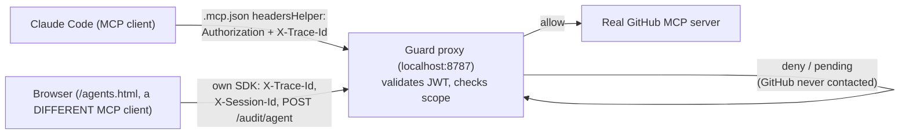

# Claude Code integration (BL-037)

**Navigation:** [Guard proxy](guard-proxy.md) · [Architecture](ARCHITECTURE.md)

Connect Claude Code as a real MCP client to the guard proxy, so its own tool calls are scope-enforced and audited — same mechanism the browser UI uses, exercised against a second, independent MCP client for the first time.

## Architecture



Claude Code never talks to GitHub directly and never learns a guard exists — it gets a JSON-RPC response (allow, deny, or pending) from what it believes is "the GitHub MCP server." Claude Code's own local per-tool approval prompt is a separate, client-side gate that would fire before any network request, independent of the proxy's scope check — in practice, every failure mode we hit below happened at the proxy layer, before that local prompt was ever relevant.

## Setup

**1. Local `repo:read`-only M2M agent:**

```bash
curl -s -X POST http://localhost:8787/agents \
  -H "Content-Type: application/json" \
  -d '{"name":"claude-code-local","serverId":"github","scopes":["repo:read"]}'
```

Returns `clientId`/`clientSecret` (shown once). Add them to the gitignored `scripts/dev.env` (not `.example`) as `MCP_AGENT_CLIENT_ID`/`MCP_AGENT_CLIENT_SECRET` — see the block added to `scripts/dev.env.example` for the exact var names.

**2. `scripts/claude-mcp-token-helper.sh`** — a `headersHelper` that `POST`s `{clientId, clientSecret}` to `$PROXY_URL/token`, and prints `{"Authorization": "Bearer <jwt>", "X-Trace-Id": "cc-<uuid>"}` to stdout. Because Claude Code invokes this script as a subprocess of its own already-running process (which only has the environment it was launched with), the script also falls back to sourcing `scripts/dev.env` directly at call time if the two vars aren't already in its environment — so adding/rotating credentials in `dev.env` takes effect on the next call, with no Claude Code restart required.

**3. Register the server:**

```bash
claude mcp add-json github-guarded '{"type":"http","url":"http://localhost:8787/github/mcp","headersHelper":"./scripts/claude-mcp-token-helper.sh"}' --scope local
```

Stored in `~/.claude.json` under `local` scope — nothing MCP-config-related is committed to this repo. `claude mcp get github-guarded` shows `Status: ✔ Connected` once `make dev` is running.

## What actually happens

All three scenarios below used the same `repo:read`-only agent against this repo's own `github-guarded` connection, targeting `peterkrentel/mcp-tool-guard`.

### Read-allow — `get_file_contents`

Calling `get_file_contents` for `README.md` returned the real file content directly as a tool result — no local approval prompt appeared (there was nothing sensitive to gate). `/audit` showed the expected pair, correlated by trace id:

```json
{ "decision": "allow", "tool": "get_file_contents", "required_scope": "repo:read",
  "token_scopes": ["repo:read"], "trace_id": "cc-b2723cd3-...", "source": "proxy" }
{ "decision": "allow", "tool": "get_file_contents", "source": "mcp",
  "upstream_status": 200, "trace_id": "cc-b2723cd3-..." }
```

### Write-deny-then-pending — `create_or_update_file`

With `MCP_APPROVAL_QUEUE=true` already active on the running proxy, a `create_or_update_file` call (needs `repo:write`, agent only has `repo:read`) produced **both** a `deny` and a `pending` audit row at the identical timestamp — the proxy logs the scope-check failure and, because the approval queue is enabled, routes the request to pending instead of hard-denying:

```json
{ "decision": "deny", "reason": "Missing required scope 'repo:write'", "source": "proxy", "trace_id": "cc-b2723cd3-..." }
{ "decision": "pending", "reason": "Awaiting approval (pr_5e774d9cbf1a)", "source": "proxy", "trace_id": "cc-b2723cd3-..." }
```

Claude Code's own tool call has no concept of a pending/retriable MCP response. It simply waited out its idle timeout and errored to the user:

```
MCP server "github-guarded" tool "create_or_update_file" sent no response or progress
for 300s; aborting. If this server is configured in your MCP settings, set a per-server
"timeout" (ms) to allow longer silent runs for just this server; otherwise set
CLAUDE_CODE_MCP_TOOL_IDLE_TIMEOUT (ms) globally (0 disables).
```

A human then approved `pr_5e774d9cbf1a` via `/agents.html`, ~4:49 after the original call had already timed out client-side. That produced a third audit row:

```json
{ "decision": "allow", "reason": "Pending request approved (pr_5e774d9cbf1a)", "source": "proxy", "trace_id": "cc-b2723cd3-..." }
```

**No `source:"mcp"` row followed it, and the file was never created on GitHub** — confirmed by re-fetching the path afterward. Approving a pending request only updates the queue's own state; it does not itself replay the original write. See "The approval-then-lost-write gap" below.

We then manually reconstructed and replayed the original request (we still had the arguments from having made the call ourselves), minting a fresh approval token and POSTing directly to `/github/mcp` with an `x-approval-token` header:

```bash
curl -X POST http://localhost:8787/pending/pr_5e774d9cbf1a/approve \
  -H "Content-Type: application/json" -d '{"resolvedBy":"..."}'
# -> {"approval_token":"at_a09086f254ed", ...}

curl -X POST http://localhost:8787/github/mcp \
  -H "Authorization: Bearer <agent JWT>" \
  -H "x-approval-token: at_a09086f254ed" \
  -H "Content-Type: application/json" \
  -d '{"jsonrpc":"2.0","id":1,"method":"tools/call","params":{"name":"create_or_update_file","arguments":{...}}}'
```

This succeeded and produced a real GitHub commit — confirming the deny → pending → approve → forward mechanism is fully correct end-to-end. The gap is entirely on the client side: nothing automatically performs that replay for a client (like Claude Code) that doesn't implement it.

## The approval-then-lost-write gap

The browser `GatewayAgent` (`ui/src/gateway-agent.ts`, `retryApprovedTool`) handles pending responses by holding the tool name/args in memory, polling `GET /pending/:id`, and re-issuing the call with `x-approval-token` once approved. Claude Code (and, by construction, any simple MCP client) has no equivalent — and critically, **the guard proxy itself never persists the original request arguments** (`gateway/pending-store.ts`'s `PendingRequest` only stores metadata: server, tool, scopes, timestamps). Once the original caller gives up, an approved write is silently unrecoverable unless whoever approved it also happens to still have the original arguments.

This is filed as its own backlog item (not folded into BL-037) since it affects any MCP-client-compatibility story, not just Claude Code: see `backlog.md` and the design spec at `docs/superpowers/specs/2026-07-19-pending-approval-long-poll-design.md`, which evaluates holding the original connection open at the proxy (so a simple client's single request just waits and gets the real result) against a client-side retry wrapper.

## `headersHelper` limitations

`headersHelper` runs once per connect/reconnect, not per individual tool call — the `cc-`-prefixed `X-Trace-Id` it generates is therefore a **session-level** grouping key (confirmed: every call across all three scenarios above shared the same `trace_id`), not per-call granularity like the browser SDK's. There's also a known upstream limitation where the helper isn't reliably re-invoked mid-session on a long-lived HTTP transport ([anthropics/claude-code#53267](https://github.com/anthropics/claude-code/issues/53267)) — a vended token can go stale mid-session, recoverable only via the retry-once-on-401 behavior (v2.1.193+) or a manual reconnect. Not a bug in this project; documented here so it isn't mistaken for one.

## Observability

Claude Code's calls appear in `GET /audit` as `source:"proxy"` (and `source:"mcp"` on successful forward) only — never `source:"agent"`, since that's the browser SDK's own convention that Claude Code has no knowledge of. The `cc`-prefixed trace id groups one Claude Code session's calls together in both the audit log and the [Claude Code client Grafana dashboard](../dashboards/grafana/mcp-tool-guard-claude-code-client.dashboard.json) (filtered on `mcp.trace_id =~ "cc-.*"`), but does not distinguish individual tool calls within that session.

## Generalizing to other harnesses

The underlying pattern (guard proxy in front, Bearer JWT via a refreshable-header mechanism) is harness-agnostic by construction — any MCP client supporting remote HTTP servers with a custom auth header (OpenCode, VS Code's native MCP support, etc.) should work the same way; only the config syntax differs. Not documented here — out of scope for this task.
