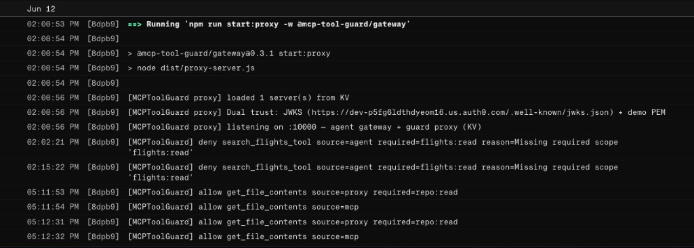

# Live demo — guard proxy in prod

**Navigation:** [Deploy overview](deploy-overview.md) · [Render deploy](render-deploy.md) · [Cursor guide](cursor-guide.md) · [README Live demo](../README.md#live-demo)

Five-minute script to prove **authoritative enforcement** on the Render guard proxy — for reviewers, stakeholders, or your own code walkthrough.

**This is the product demo** — not a tour of the repo or the chat UI. The system proves itself via API behavior: scoped JWT in → allow/deny out → `/audit` replay.

| Minimum viable demo | Optional |
| ------------------- | -------- |
| **Demo 6** (GitHub curl allow) + Render logs · or flight **Demo 4** (curl deny) + **Demo 5** (`/audit`) | UI chat, agent trace panel, WebLLM |

**Track 2 prod proof (screenshots + checklist):** [track2-github-proof.md](track2-github-proof.md).

Do not extend the demo with more mock MCPs or UI features unless they show a **new** enforcement or audit story. See [ROADMAP → Build filter](ROADMAP.md#build-filter).

---

## Architecture (prod today)

```text
Browser / curl  →  Render guard proxy  →  upstream MCP
                      ↑ JWT scopes        flight (Vercel)  OR  github (GitHub Copilot)
                      ↑ GET /audit
                      ↑ GITHUB_MCP_TOKEN (upstream only — github server)
```

| Service | URL |
| ------- | --- |
| **UI** | [mcp-tool-guard-ui.vercel.app](https://mcp-tool-guard-ui.vercel.app/) |
| **Guard proxy** | [mcp-tool-guard-proxy.onrender.com](https://mcp-tool-guard-proxy.onrender.com/health) |
| **Flight** | [mcp-tool-guard-flight-server.vercel.app/health](https://mcp-tool-guard-flight-server.vercel.app/health) |

Two-layer model:

| Layer | Where | Role |
| ----- | ----- | ---- |
| **Client pre-check** | Browser (`ui/src/agent.ts`) | UX — blocks obvious denies before network |
| **Proxy enforce** | Render (`gateway/proxy-server.ts`) | **Authoritative** — cannot bypass with a direct HTTP call |

---

## Demo 1 — Proxy is in the path (30 s)

1. Open [the UI](https://mcp-tool-guard-ui.vercel.app/).
2. Sign in (Auth0) or pick a guest JWT → **Initialize**.
3. Open **DevTools → Network**.
4. Chat: *Search flights from SFO to JFK*.

**Proof:** Requests go to `mcp-tool-guard-proxy.onrender.com` for `/mcp` and `/audit`, not directly to `mcp-tool-guard-flight-server.vercel.app`.

---

## Demo 2 — Read-only Auth0 user (2 min)

Use `demo-read@…` (or guest **read_only** token).

| Action | Audit panel | Proxy |
| ------ | ----------- | ----- |
| Search flights | **Server** ALLOW | Request reaches proxy → allow |
| Book a flight | **Agent attempts** DENY only | No matching server row (blocked client-side) |

Screenshot reference: [prod-scope-deny-read-only.png](images/demo/prod-scope-deny-read-only.png).

**Talking point:** Client deny is fast UX; proxy is still the enforcement boundary for anything that hits the network.

---

## Demo 3 — Admin book + cancel (2 min)

Sign in as admin (full `flights:*` permissions).

1. Search → ALLOW in audit.
2. Book → ALLOW; chat shows booking id.
3. Cancel → ALLOW; may show **ALERT** in Render logs for `flights:delete`.

**Proof (Render dashboard → Logs):**

```text
[MCPToolGuard] allow search_flights_tool
[MCPToolGuard] allow create_booking_tool
[MCPToolGuard ALERT] allow cancel_booking_tool
```

---

## Demo 4 — Proxy deny bypassing the UI (1 min)

Prove enforcement without the browser — direct `curl` to the proxy.

```bash
PROXY=https://mcp-tool-guard-proxy.onrender.com
# read_only token from ui/public/demo-tokens.json
TOKEN="<paste read_only JWT>"

curl -s -X POST "$PROXY/mcp" \
  -H "Authorization: Bearer $TOKEN" \
  -H "Content-Type: application/json" \
  -H "Accept: application/json, text/event-stream" \
  -d '{"jsonrpc":"2.0","id":1,"method":"tools/call","params":{"name":"create_booking_tool","arguments":{"flight_id":"FL505","passenger_name":"Curl"}}}'
```

**Expected:** JSON-RPC error `code: -32001` (scope denied). Render log: `[MCPToolGuard] deny create_booking_tool`.

**Important:** Include `Accept: application/json, text/event-stream` — curl’s default breaks SSE forwarding to flight.

---

## Demo 6 — GitHub MCP (external upstream) {#demo-6--github-mcp-external-upstream}

**Prod proof recorded:** [track2-github-proof.md](track2-github-proof.md) (curl allow + Render logs, June 2026).

Prove scope enforcement on a **vendor MCP you do not control**. The proxy substitutes `GITHUB_MCP_TOKEN` for upstream auth — callers still present their **Auth0 M2M JWT** for scope checks. The PAT never appears in responses or audit rows.




### Prerequisites

1. Add `repo:read` and `repo:write` permissions to your Auth0 API (`https://mcp-tool-guard`).
2. Set `GITHUB_MCP_TOKEN` on Render (fine-grained PAT with repo access for the demo repo).
3. Redeploy proxy. `GET /health` → `"upstream_auth_missing": []` (empty when PAT is set).
4. Create a read-only M2M agent on [`/agents.html`](../ui/agents.html): MCP server **github**, scopes `repo:read` → **Use** to vend token. (Same as `POST /agents` with `"scopes": ["repo:read"], "serverId": "github"`.)

**Discover real tool names** (optional — policy in yaml may need tuning):

```bash
curl -s "$PROXY/servers/github/tools" | jq '.tools[].name'
```

### Allow — read-scoped agent token

```bash
PROXY=https://mcp-tool-guard-proxy.onrender.com
TOKEN="<M2M agent JWT with repo:read>"

curl -s -X POST "$PROXY/github/mcp" \
  -H "Authorization: Bearer $TOKEN" \
  -H "Content-Type: application/json" \
  -H "Accept: application/json, text/event-stream" \
  -d '{"jsonrpc":"2.0","id":1,"method":"tools/call","params":{"name":"get_file_contents","arguments":{"owner":"YOUR_ORG","repo":"YOUR_REPO","path":"README.md"}}}'
```

**SSE note:** GitHub MCP responses are `text/event-stream`. Pipe through `grep '^data: '` before `jq` (see [track2-github-proof.md](track2-github-proof.md)).

### Deny — write tool without repo:write (proxy blocks before GitHub)

Use a **`repo:read`-only** agent token (e.g. `github-test01-read` on `/agents.html`).

```bash
curl -s -X POST "$PROXY/github/mcp" \
  -H "Authorization: Bearer $TOKEN" \
  -H "Content-Type: application/json" \
  -H "Accept: application/json, text/event-stream" \
  -d '{"jsonrpc":"2.0","id":2,"method":"tools/call","params":{"name":"create_or_update_file","arguments":{}}}' | jq .
```

**Expected:** JSON-RPC error `code: -32001`, message `Missing required scope 'repo:write'`. Render log: `[MCPToolGuard] deny create_or_update_file source=proxy`.

**Format note:** Proxy deny is **plain JSON** — use `jq .` directly. Allow responses from GitHub are SSE — use `grep '^data: '` (see [track2-github-proof.md](track2-github-proof.md)).


### Audit

```bash
curl -s -H "Authorization: Bearer $TOKEN" "$PROXY/audit" | jq '.entries[-3:]'
```

**Talking point:** Same JWT scope model as flight — different upstream credential for the vendor MCP.

**Browser demo:** keep [Flight demo `/`](../ui/index.html) **Server enforcement** panel for enforce + audit; use [`/agents.html`](../ui/agents.html) to provision GitHub agents and review the shipped approval queue panel.

---

## Demo 5 — Audit API (30 s)

```bash
curl -s -H "Authorization: Bearer $TOKEN" "$PROXY/audit" | jq '.source'
# → "guard-proxy"
```

---

## Demo 7 — Approval queue (end-to-end on `/agents.html`) {#demo-7--approval-queue-end-to-end}

**Prerequisites:** `MCP_APPROVAL_QUEUE=true` on Render; at least one agent with limited scope (e.g. `flights:read` only on flight, or `repo:read` on GitHub).

**This demo proves on-demand scope escalation + human approval:**

### Step 1: Agent with limited scope

1. Open [`/agents.html`](../ui/agents.html).
2. On **Approval queue** panel (left), note **Refresh** button.
3. Create or use an agent with read-only scopes (e.g., `repo:read` on GitHub).
4. Initialize with that agent.

### Step 2: Attempt escalated tool (expect pending approval)

```bash
PROXY=https://mcp-tool-guard-proxy.onrender.com
TOKEN="<M2M agent JWT with repo:read only>"

curl -s -X POST "$PROXY/github/mcp" \
  -H "Authorization: Bearer $TOKEN" \
  -H "Content-Type: application/json" \
  -H "Accept: application/json, text/event-stream" \
  -d '{"jsonrpc":"2.0","id":1,"method":"tools/call","params":{"name":"create_or_update_file","arguments":{"owner":"USER","repo":"REPO","path":"test.txt","content":"Hello from approval"}}}'
```

**Expected:** HTTP 202 response with `pending_id`:

```json
{
  "result": {
    "status": "pending",
    "pending_id": "pr_abc123xyz"
  }
}
```

**Audit panel (left):** New entry under **Approval queue** → **Pending tool calls awaiting human approval.**

### Step 3: Admin approves

Click **Approve** on the pending entry in the Approval queue panel.

**Render logs:** `[MCPToolGuard] allow create_or_update_file … Pending request approved (pr_abc123xyz)`.

### Step 4: Retry with approval token (agent polls + retries automatically)

In browser agent, the retry happens in the background via `retryApprovedTool()` polling loop ([ui/src/gateway-agent.ts](../ui/src/gateway-agent.ts#L165)).

For curl (manual), fetch the approval token:

```bash
curl -s -H "Authorization: Bearer $TOKEN" "$PROXY/pending/pr_abc123xyz" | jq '.approval_token'
# → "at_xyz123…"
```

Then retry with `X-Approval-Token` header:

```bash
APPROVAL_TOKEN="<paste token from above>"

curl -s -X POST "$PROXY/github/mcp" \
  -H "Authorization: Bearer $TOKEN" \
  -H "X-Approval-Token: $APPROVAL_TOKEN" \
  -H "Content-Type: application/json" \
  -H "Accept: application/json, text/event-stream" \
  -d '{"jsonrpc":"2.0","id":2,"method":"tools/call","params":{"name":"create_or_update_file","arguments":{"owner":"USER","repo":"REPO","path":"test.txt","content":"Hello from approval"}}}'
```

**Expected:** Successful response from GitHub MCP (SSE format):

```
data: {"jsonrpc":"2.0","id":2,"result":{"content":"...","message":"File updated"}}
```

**Render logs:** `[MCPToolGuard] allow create_or_update_file … Approved via token (pr_abc123xyz)` followed by `[MCPToolGuard MCP] allow` with GitHub response.

### Audit trail

In **Proxy decisions** audit section:

1. First attempt: DENY `create_or_update_file` — "Missing required scope 'repo:write'"
2. Pending record created — "Awaiting approval (pr_abc123xyz)"
3. Admin approval logged — "Pending request approved (pr_abc123xyz)"
4. Retry with token: ALLOW — "Approved via token (pr_abc123xyz)"
5. Upstream MCP allow — "create_or_update_file returned OK"

**Talking point:** Token is opaque, single-use, and bound to this specific server + tool. Scope does not change on the JWT; the approval is a one-time override. Approval tokens expire after 1 hour.

**Related proof:** [track3-approval-queue-proof.md](track3-approval-queue-proof.md).

---

## Code review path (after the demo)

Read in this order to understand the flow:

| Order | File | What you learn |
| ----- | ---- | -------------- |
| 1 | [deploy-overview.md](deploy-overview.md) | Local vs prod paths |
| 2 | `gateway/config.yaml` + `config.prod.yaml` | Policy: server → url + tool → scope |
| 3 | `gateway/guard.ts` | JWT verify, `authorize()`, deny reasons |
| 4 | `gateway/proxy-server.ts` | Routes, enforce on `tools/call`, forward, `/audit` |
| 5 | `ui/src/agent.ts` | Client pre-check before MCP |
| 6 | `ui/src/mcp-client.ts` | Headers (`Accept`, Bearer, trace) |
| 7 | `ui/src/audit-view.ts` | Three panels, session filter |

**Related shipped proof:** [track3-approval-queue-proof.md](track3-approval-queue-proof.md).

**Hardening next:** audit export, SDK packaging, Auth0 registry sync, and broader backend-agent deployment.

**GitHub request to trace:** curl/agent JWT → `POST /github/mcp` → proxy `authorize(repo:read)` → forward with `GITHUB_MCP_TOKEN` → GitHub MCP → SSE result.

**Flight request to trace:** chat → `agent.ts` authorize → `mcp-client.ts` POST `/mcp` → proxy → flight.
