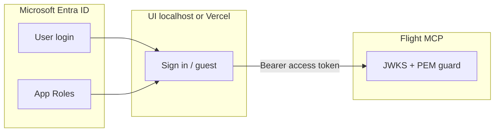

# Entra ID setup (0.5.0)

**Navigation:** [Identity overview](identity.md) · [Auth0 setup](auth0-setup.md) · [Next steps](NEXT-STEPS.md)

One-time Microsoft Entra ID tenant configuration for the demo UI and flight MCP server: script-driven app registration, local dev env vars, token verification, and troubleshooting.

**Prerequisite:** an Entra tenant must already exist. Create one in the Azure Portal (Microsoft Entra ID → Manage tenants → + Create, ~5 min), then follow this guide.

---

## Overview



| Component | Entra role |
|-----------|-----------|
| **SPA** (`mcp-tool-guard`) | User logs in; gets access token |
| **API** (`api://<api-app-id>`) | Protected API; defines flight, repo, gateway roles |
| **Management app** | Service principal for M2M agent provisioning (Graph API) |
| **Flight server** | Validates token (JWKS + scopes); **not** an Entra app |

---

## Part 1 — One-time setup via `entra-setup.sh`

### Step 1 — Prerequisite: create your Entra tenant (portal-only)

1. Navigate to [portal.azure.com](https://portal.azure.com)
2. Search for **Microsoft Entra ID**
3. **Manage tenants** → **+ Create**
4. Fill in **Organization name** and **Initial domain name** (e.g., `mcp-tool-guard`)
5. Wait ~5 min for creation to complete
6. Click the new tenant to enter it

Confirm you are in the new tenant: Microsoft Entra ID → **Tenant information** (top-left dropdown shows your tenant name).

### Step 2 — Authenticate the Azure CLI and run the script

In your terminal, in this repository:

```bash
az login --tenant <your-tenant-id>
```

or simply:

```bash
az login
```

Then select your new Entra tenant when prompted. Verify:

```bash
az account show
```

Should display your tenant ID and tenant domain.

Run the setup script:

```bash
scripts/entra-setup.sh
```

The script will:
1. Read your tenant ID
2. Create a protected API app registration
3. Define Entra App Roles matching scope strings (`flights:read`, `repo:write`, `gateway:admin`, etc.)
4. Create a management app (for M2M agent provisioning)
5. Grant Graph API permissions with admin consent
6. Create an SPA app registration (for browser login)
7. Output all required env vars

**Example output:**

```
ENTRA_TENANT_ID=12345678-1234-1234-1234-123456789012
ENTRA_API_APP_ID=87654321-4321-4321-4321-210987654321
ENTRA_CLIENT_ID=aaaaaaaa-aaaa-aaaa-aaaa-aaaaaaaaaaaa
ENTRA_CLIENT_SECRET=AbCdEfGhIjKlMnOpQrStUvWxYz1234567890
VITE_ENTRA_CLIENT_ID=bbbbbbbb-bbbb-bbbb-bbbb-bbbbbbbbbbbb
VITE_ENTRA_TENANT_ID=12345678-1234-1234-1234-123456789012
VITE_ENTRA_API_APP_ID=87654321-4321-4321-4321-210987654321
```

**Save this output.** You will not see the secret again; if lost, regenerate via:

```bash
az ad app credential reset --id <ENTRA_CLIENT_ID>
```

---

## Part 2 — Local development

### Two places for env vars (common gotcha)

| Where | Read by | Variables |
|-------|---------|-----------|
| **`scripts/dev.env`** | Gateway proxy + flight server | `ENTRA_*`, `MCP_IDP_PROVIDER` |
| **`ui/.env.local`** | Vite (UI only) | `VITE_*` only |

**Do not put `ENTRA_*` in `ui/.env.local`** — Vite does not pass them to the server, so tokens will fail. Same split on Vercel: flight project vs UI project.

### Step 3 — Gateway env file

Add to **`scripts/dev.env`** (gitignored), replacing the values from Step 2:

```bash
MCP_IDP_PROVIDER=entra
ENTRA_TENANT_ID=12345678-1234-1234-1234-123456789012
ENTRA_API_APP_ID=87654321-4321-4321-4321-210987654321
ENTRA_CLIENT_ID=aaaaaaaa-aaaa-aaaa-aaaa-aaaaaaaaaaaa
ENTRA_CLIENT_SECRET=AbCdEfGhIjKlMnOpQrStUvWxYz1234567890
```

`MCP_IDP_PROVIDER=entra` tells the gateway to use Entra instead of Auth0 (see [BL-034: Single-active-provider trust model](../backlog.md#bl-034)).

### Step 4 — UI env file

Create or update **`ui/.env.local`** (gitignored):

```bash
VITE_IDP_PROVIDER=entra
VITE_ENTRA_TENANT_ID=12345678-1234-1234-1234-123456789012
VITE_ENTRA_CLIENT_ID=bbbbbbbb-bbbb-bbbb-bbbb-bbbbbbbbbbbb
VITE_ENTRA_API_APP_ID=87654321-4321-4321-4321-210987654321
VITE_MCP_URL=http://localhost:5173/mcp
```

Restart **`make ui`** after any change (Vite reads env at startup).

### Step 5 — Flight server (Entra path)

Guest demo works without these. For **Sign in** tokens, both the gateway proxy and the flight server validate JWTs via the generic `MCP_JWT_*` trust vars (`gateway/env.ts`'s `jwtTrustFromEnv()`, `servers/flight/guard.py`'s `JwtTrustConfig.from_env()`) — **not** `ENTRA_TENANT_ID` / `ENTRA_API_APP_ID` directly. Those `ENTRA_*` vars only drive the setup script and the M2M management app; they are never read to derive the issuer or JWKS URL. Add the `MCP_JWT_*` vars explicitly to **`scripts/dev.env`**, alongside the `ENTRA_*` vars from Step 3:

```bash
export MCP_JWT_ISSUER=https://login.microsoftonline.com/<tenant-id>/v2.0
export MCP_JWT_AUDIENCE=api://<ENTRA_API_APP_ID>
export MCP_JWT_JWKS_URL=https://login.microsoftonline.com/<tenant-id>/discovery/v2.0/keys
```

Then start flight with the gateway env:

```bash
source scripts/dev.env
make flight
```

**Why `MCP_JWT_JWKS_URL` must be set explicitly for Entra (unlike Auth0):** when `MCP_JWT_JWKS_URL` is unset, both `jwtTrustFromEnv()` and `JwtTrustConfig.from_env()` auto-derive it as `${MCP_JWT_ISSUER}/.well-known/jwks.json`. That formula happens to match Auth0's JWKS endpoint, so Auth0 setups can leave `MCP_JWT_JWKS_URL` unset. It does **not** match Entra — Entra's real JWKS endpoint is `https://login.microsoftonline.com/<tenant-id>/discovery/v2.0/keys`, a different path. Leaving `MCP_JWT_JWKS_URL` unset here would silently point at a JWKS URL that doesn't exist, so for Entra you must set all three vars above.

### Step 6 — Assign roles and test user (optional)

To test sign-in with scoped tokens, create a test user in Entra:

1. **Microsoft Entra ID → Users → + New user → Create new user**
2. Fill in username and password
3. Select **User** → **Create**

Then assign the user an App Role:

1. Open the **mcp-tool-guard-api** app registration
2. **Managed application in local directory** (at the bottom)
3. **Users and groups** tab → **+ Add user/group**
4. Select your test user
5. Assign a role (e.g., `flights:read` for read-only demo, or `flights:read`, `flights:write`, `flights:delete` for admin testing)

When the user signs in, their access token will carry the assigned roles as `roles` claim (Entra's equivalent to Auth0 `permissions`).

### Step 7 — Sign in and smoke test

1. Click **Sign in** → Entra tenant login → return to localhost
2. **Initialize** (WebLLM may take ~1 min first load)
3. *Search flights from SFO to JFK* → **allow** (needs `flights:read`)
4. *book FL101 Name, email@example.com* → **allow** (needs `flights:write`)
5. *Cancel booking BK-…* using the ID from step 4 → **allow** (needs `flights:delete`)

Guest mode still works: use JWT dropdown without signing in.

**In-memory bookings** reset when the flight process restarts; book and cancel in one session.

---

## Part 3 — Verify the access token

Use the **access token**, not the ID token.

### Where to find it in the browser

**DevTools → Application → Local Storage → `http://localhost:5173`**

Look for a key containing your Entra tenant or app ID. Copy the JWT (`eyJ…` string).

Decode at [jwt.io](https://jwt.io). **Good access token payload (Entra):**

```json
{
  "iss": "https://login.microsoftonline.com/<tenant-id>/v2.0",
  "aud": "api://<entra-api-app-id>",
  "roles": ["flights:read", "flights:write"]
}
```

| Claim | Meaning |
|-------|---------|
| `iss` | Entra token issuer (matches your tenant ID) |
| `aud` | API app ID (matches `ENTRA_API_APP_ID`) |
| `roles` | Entra App Roles assigned to the user (enforced by MCPToolGuard) |

After assigning or changing roles: **Sign out → Sign in** (old tokens do not update).

---

## Env var reference

| Variable | Where | Source |
|---|---|---|
| `ENTRA_TENANT_ID` | gateway (`scripts/dev.env`) | `entra-setup.sh` output |
| `ENTRA_CLIENT_ID`/`ENTRA_CLIENT_SECRET` | gateway | management app, `entra-setup.sh` output |
| `ENTRA_API_APP_ID` | gateway | protected API app, `entra-setup.sh` output |
| `MCP_IDP_PROVIDER=entra` | gateway | explicit selector, per BL-034 |
| `VITE_IDP_PROVIDER=entra` | ui (`.env.local`) | selects the UI's login flow |
| `VITE_ENTRA_TENANT_ID`/`VITE_ENTRA_CLIENT_ID`/`VITE_ENTRA_API_APP_ID` | ui | SPA app, `entra-setup.sh` output |

`MCP_JWT_ISSUER`/`MCP_JWT_AUDIENCE`/`MCP_JWT_JWKS_URL` are separate from the table above — they are not produced by `entra-setup.sh` and must be set by hand (Step 5).

---

## Troubleshooting

| Symptom | Cause | Fix |
|---------|--------|-----|
| Sign in redirect error | Redirect URI mismatch | Add exact `http://localhost:5173` to SPA Settings under **Authentication → Redirect URIs** |
| Token missing `roles` claim | User has no App Roles assigned | Step 6 — open the managed app, Users and groups tab, assign the user a role |
| "App Role not assignable to service principal" error assigning `flights:*` / `repo:*` to an M2M agent | App Role `allowedMemberTypes` not set to `"Application"` | Re-run `scripts/entra-setup.sh` — the `az rest PATCH` step (line 51–54) sets these roles with `"allowedMemberTypes": ["Application"]`. If the script ran but the role still lacks this setting, check the protected API app's **App roles** tab in Entra portal and confirm it shows "Application" under "Allowed member types". |
| Same error assigning **`gateway:admin`** to a service principal | Not a bug — `gateway:admin` is intentionally defined with `"allowedMemberTypes": ["User"]` only (see `scripts/entra-setup.sh`). It is a human-operator-only permission and is never meant to be assignable to an M2M agent. | Don't assign `gateway:admin` to an M2M agent. Assign it to a human user in the Entra directory instead (Step 6-style: **Users and groups** on the API app's managed application). Re-running the PATCH step will not change this — re-running it would not fix anything here. |
| No `roles` in token but user has role assigned | User roles not synced to token | Entra caches tokens for ~1 hour; sign out completely, clear browser cache, and sign in again |
| Guest works, Entra fails on server | Missing `MCP_IDP_PROVIDER=entra` in flight terminal | Step 3–5: source `scripts/dev.env` or export `MCP_IDP_PROVIDER` before `make flight`; restart flight process |
| Token `aud` mismatch | Using wrong app (user app instead of protected API app) | Verify sign-in is using the **mcp-tool-guard-spa** app, not the **mcp-tool-guard-api** (API) app. If both exist, remove the duplicate. |

---

## Vercel environment variables

Deploy **flight first**, then **UI**. See [vercel-deploy.md](vercel-deploy.md).

### Flight (`mcp-tool-guard-flight-server`)

| Variable | Example |
|----------|---------|
| `MCP_IDP_PROVIDER` | `entra` |
| `ENTRA_TENANT_ID` | From Step 1 |
| `ENTRA_API_APP_ID` | From Step 1 |
| `MCP_JWT_ISSUER` | `https://login.microsoftonline.com/<tenant-id>/v2.0` |
| `MCP_JWT_AUDIENCE` | `api://<ENTRA_API_APP_ID>` |
| `MCP_JWT_JWKS_URL` | `https://login.microsoftonline.com/<tenant-id>/discovery/v2.0/keys` — required, does not auto-derive correctly for Entra (see Step 5) |
| `MCP_GUARD_PUBLIC_KEY_PEM` | Keep — guest demo PEM (dual trust) |

### UI (`mcp-tool-guard-ui`)

| Variable | Example |
|----------|---------|
| `VITE_IDP_PROVIDER` | `entra` |
| `VITE_ENTRA_TENANT_ID` | From Step 1 |
| `VITE_ENTRA_CLIENT_ID` | From Step 1 |
| `VITE_ENTRA_API_APP_ID` | From Step 1 |
| `VITE_MCP_URL` | `https://mcp-tool-guard-flight-server.vercel.app/mcp` |

Redeploy **both** after env changes (UI needs a **rebuild**).

---

## Related

- [identity.md](identity.md) — dual trust (guest PEM + Entra JWKS), single-active-provider model
- [auth0-setup.md](auth0-setup.md) — alternative IdP setup for Auth0
- [vercel-deploy.md](vercel-deploy.md) — deployment checklist
