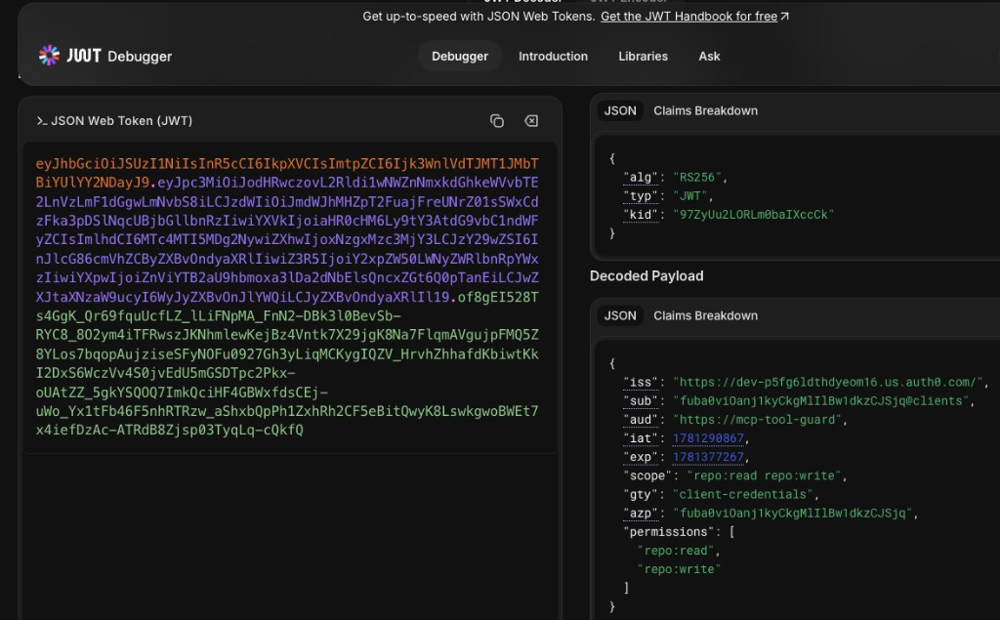
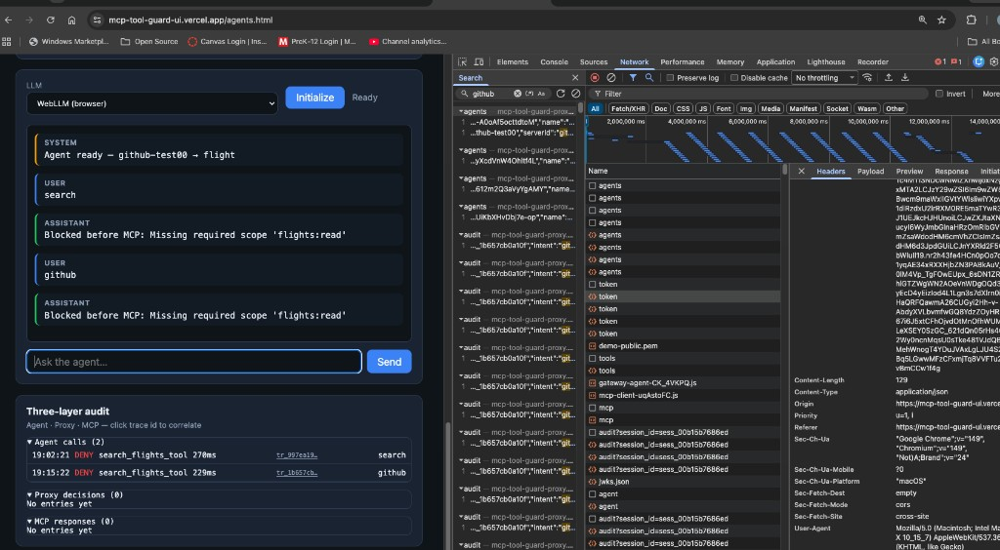

# Track 2 proof — GitHub MCP (prod)

**Navigation:** [Demo script](demo-proxy.md) · [Cursor guide Track 2](cursor-guide.md#track-2--wire-github-mcp-as-the-first-external-upstream) · [CONCEPT → unowned MCP](CONCEPT.md#third-party--unowned-mcp) · [Render deploy](render-deploy.md)

Shipped and **smoke-tested on prod** after [feature/github-mcp-track-2](https://github.com/peterkrentel/mcp-tool-guard/tree/feature/github-mcp-track-2) (merged to `main`).

This doc records the **credibility proof** for the first **external upstream** — not flight chat UX.

---

## What was proven

| Claim | Evidence |
|-------|----------|
| Proxy routes `POST /github/mcp` to GitHub Copilot MCP | curl `get_file_contents` returned repo `README.md` |
| Scope enforcement uses **caller JWT** (`repo:read`) | Render log: `allow get_file_contents source=proxy required=repo:read` |
| Upstream auth uses **server PAT** (`GITHUB_MCP_TOKEN`), not caller JWT | PAT never in response; proxy substitutes Bearer on forward |
| Three-layer audit path works for vendor MCP | Render log: `allow get_file_contents source=mcp` after proxy allow |
| Tool discovery works | `GET /servers/github/tools` returned 40+ GitHub MCP tools |
| Health shows wiring | `"upstream_auth_missing": []`, `"github"` in `servers` |

**Canonical allow proof:** curl + Render logs. UI chat on `/agents.html` is optional transport (LLM must emit a tool call).

---

## Architecture (prod)

```
curl / agents UI  →  Render guard proxy  →  GitHub Copilot MCP
     ↑ M2M JWT          ↑ repo:* policy       ↑ GITHUB_MCP_TOKEN (PAT)
     (repo:read)        ↑ /audit              (read-only on demo PAT)
```

| Credential | Holder | Used for |
|------------|--------|----------|
| **M2M agent JWT** | Operator-created agent (`repo:read`, `repo:write`, …) | Proxy `tools/call` scope check |
| **`GITHUB_MCP_TOKEN`** | Render env only | Upstream `Authorization` to `api.githubcopilot.com` |

Same pattern as [CONCEPT → unowned MCP](CONCEPT.md#third-party--unowned-mcp): wide-ish upstream credential on the proxy, narrow agent scopes at enforce time.

---

## Prod configuration (reference)

| Item | Value |
|------|--------|
| Proxy | `https://mcp-tool-guard-proxy.onrender.com` |
| Upstream URL | `https://api.githubcopilot.com/mcp/` (`gateway/config.prod.yaml`) |
| Env | `GITHUB_MCP_TOKEN` (fine-grained PAT, **Contents: Read-only** on demo repo) |
| Auth0 API permissions | `repo:read`, `repo:write` (for M2M agent grants) |
| Demo repo | `peterkrentel/mcp-tool-guard` |
| Agent | M2M `github-test00` → `serverId: github`, scopes `repo:read`, `repo:write` |

---

## Screenshots

### curl allow — `get_file_contents` (README.md)


*SSE `data:` line with `"result"` and README text — proxy + GitHub path end-to-end.*

### Render logs — proxy + MCP allow


```
[MCPToolGuard] allow get_file_contents source=proxy required=repo:read
[MCPToolGuard] allow get_file_contents source=mcp
```

### Agent JWT (jwt.io)



*`sub` ends with `@clients`; `permissions`: `repo:read`, `repo:write`; `aud`: `https://mcp-tool-guard`.*

### Optional — client pre-check on `/agents.html`



*When the gateway agent targets the wrong MCP policy (e.g. flight tools with a `repo:*` token), **agent** layer denies before network — separate from proxy enforce. Use **Use → Initialize** on the correct `github` agent; curl remains the authoritative Track 2 proof.*

---

## Reproduce (curl)

**Health**

```bash
curl -s https://mcp-tool-guard-proxy.onrender.com/health | jq '{upstream_auth_missing, servers}'
```

**Read allow** — replace `TOKEN` with M2M agent JWT (`repo:read` at minimum):

```bash
curl -s -X POST https://mcp-tool-guard-proxy.onrender.com/github/mcp \
  -H "Authorization: Bearer TOKEN" \
  -H "Content-Type: application/json" \
  -H "Accept: application/json, text/event-stream" \
  -d '{"jsonrpc":"2.0","id":1,"method":"tools/call","params":{"name":"get_file_contents","arguments":{"owner":"peterkrentel","repo":"mcp-tool-guard","path":"README.md"}}}'
```

**Parse SSE for jq** (responses are `text/event-stream`, not raw JSON):

```bash
curl -s ...same as above... | grep '^data: ' | head -1 | sed 's/^data: //' | jq '.result.content[0].text'
```

**Proxy scope deny** (optional) — requires agent with **`repo:read` only** (no `repo:write`):

```bash
curl -s ... | grep '^data: ' | head -1 | sed 's/^data: //' | jq '.error.code'
# expect -32001 on create_or_update_file
```

**Write + read-only PAT** — agent with `repo:write` passes proxy; GitHub rejects upstream (PAT has no write). That proves PAT ceiling, not proxy deny.

---

## Acceptance checklist (Track 2)

- [x] `GET /servers/github/tools` returns real tool list
- [x] Read-scoped agent: `get_file_contents` proxied, audit/log `allow` at proxy + mcp
- [x] `GITHUB_MCP_TOKEN` not exposed in responses or logs
- [x] `upstream_auth_missing: []` on `/health`
- [ ] Proxy deny on write with **`repo:read`-only** agent (optional; needs agent without `repo:write`)

---

## Next

- **Product pivot:** lead demos with this proof + agent gateway, not flight WebLLM chat — see [NEXT-STEPS](NEXT-STEPS.md).
- **Track 3:** [approval queue](cursor-guide.md#track-3--approval-queue-on-demand-scope).
- **UI fix:** MCP server dropdown reset on `/agents.html` (preserve selection on refresh).
