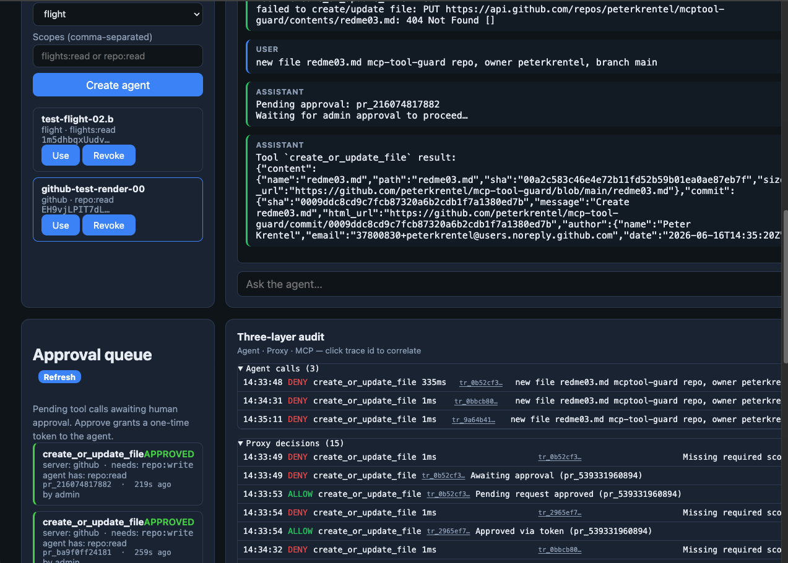
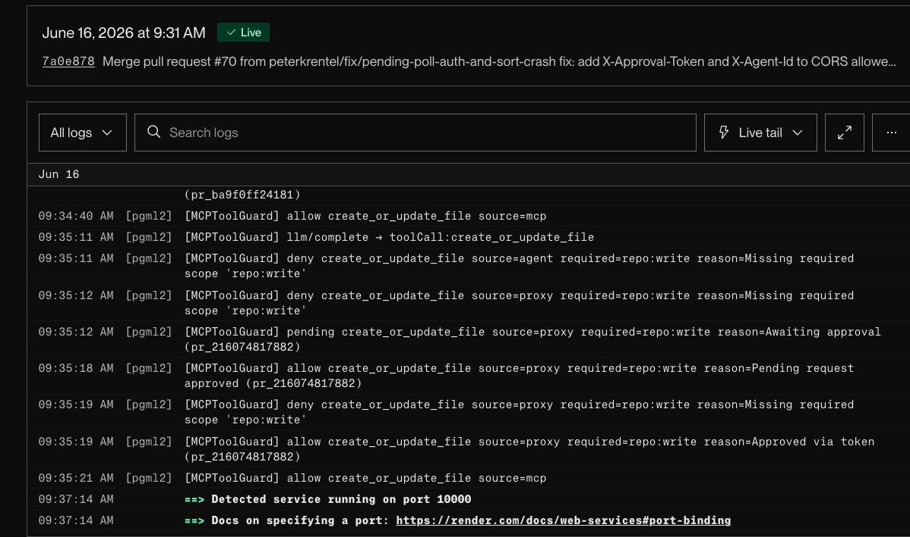

# Track 3 proof — Approval queue (prod)

**Navigation:** [Demo script](demo-proxy.md) · [CONCEPT](CONCEPT.md) · [Render deploy](render-deploy.md)

Shipped and **smoke-tested on prod** after merging `feature/tier2-hardening` + `fix/pending-poll-auth-and-sort-crash` to `main`.





---

## What was proven

| Claim | Evidence |
|-------|----------|
| Agent with `repo:read` triggers approval queue on write tool | Proxy log: `pending create_or_update_file source=proxy reason=Awaiting approval (pr_216074817882)` |
| Pending request visible in operator UI | Approval queue panel shows tool, server, required scope, agent scopes |
| Admin approval issues a one-time token | Render log: `allow … reason=Pending request approved (pr_216074817882)` |
| Agent retries with token, scope check bypassed | Render log: `allow … reason=Approved via token (pr_216074817882)` |
| Upstream call succeeds with gateway PAT | Render log: `allow create_or_update_file source=mcp` |
| File actually created in GitHub | `redme03.md` committed to `peterkrentel/mcp-tool-guard` main — [commit 0009ddc](https://github.com/peterkrentel/mcp-tool-guard/commit/0009ddc8cd9c7fcb87320a6b2cdb1f7a1380ed7b) |
| Three-layer audit captures full trace | Agent DENY → Proxy DENY+PENDING+ALLOW+ALLOW → MCP ALLOW — correlated by `trace_id` |
| Token is one-time — re-use returns 403 | Second retry with same burned token rejected |
| Polling exempt from rate limiter | No 429s on prod despite audit + pending + retry polls |

---

## Elevation flow

```
1. Agent calls create_or_update_file  →  proxy checks JWT  →  repo:write missing
2. Proxy creates pending record (pr_xxx)  →  returns 202 + pending_id to agent
3. Agent polls GET /pending/pr_xxx every 2s
4. Operator sees request in UI panel  →  clicks Approve
5. Proxy marks pending approved  →  generates one-time approval token
6. Agent receives approval_token on next poll
7. Agent retries tool call with X-Approval-Token header
8. Proxy validates token (server + tool match)  →  approvedViaToken=true  →  skips scope deny
9. Proxy forwards to GitHub with GITHUB_MCP_TOKEN (Contents: r/w)
10. GitHub creates file  →  commit SHA returned  →  agent reports success
```

---

## Render logs (proof)

```
09:35:11  deny    create_or_update_file  source=agent   reason=Missing required scope 'repo:write'
09:35:12  deny    create_or_update_file  source=proxy   reason=Missing required scope 'repo:write'
09:35:12  pending create_or_update_file  source=proxy   reason=Awaiting approval (pr_216074817882)
09:35:18  allow   create_or_update_file  source=proxy   reason=Pending request approved (pr_216074817882)
09:35:19  deny    create_or_update_file  source=proxy   reason=Missing required scope 'repo:write'
09:35:19  allow   create_or_update_file  source=proxy   reason=Approved via token (pr_216074817882)
09:35:21  allow   create_or_update_file  source=mcp
```

---

## Prod configuration

| Item | Value |
|------|-------|
| Proxy | `https://mcp-tool-guard-proxy.onrender.com` |
| `MCP_APPROVAL_QUEUE` | `true` |
| `GITHUB_MCP_TOKEN` | Fine-grained PAT — Contents: R/w, Issues: R/w, PRs: R/w |
| Demo agent | `github-test-render-00` → `serverId: github`, scopes `repo:read` |
